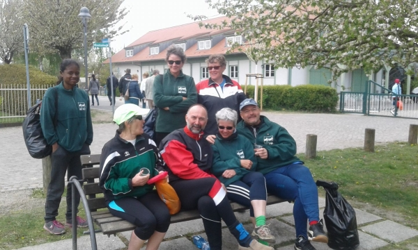

# Am ersten Mai zur Baumblüte nach Werder rudern

## wer möchte, kann auch nur eine Teilstrecke rudern

Bitte bei Luise anmelden, oder sich im Zettel am Schwarzen Brett eintragen.

Start um 9 Uhr am Bootshaus, wir sind gegen Abend zurück.

Da die Ruderstrecke 2 x 25 km beträgt, kann man wahlweise auch nur Hin- oder Rückstrecke rudern. 

Allerdings kann man sich nicht aussuchen, welche Strecke man rudert. Luise teilt am Donnerstag vorher die Hin- und Rückreisenden ein.
Natürlich dürft ich auch gerne beide Strecken rudern.

Wir weisen noch einmal darauf hin, dass auf dem Wasser die 0,5 Promille Grenze gilt.
