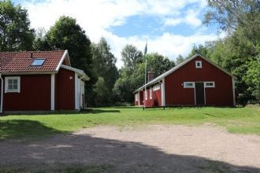
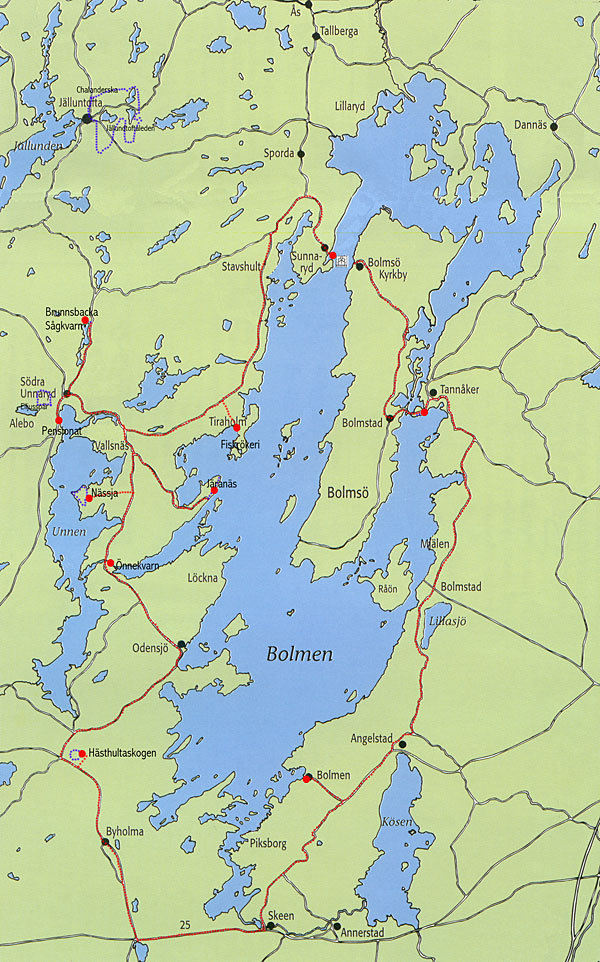

# 6. - 15. August 2027

## Letze Woche der Sommerferien 

Wir nehmen die Nachtfähre am Freitag ab Rostock. Start in Stahnsdorf gegen 16 Uhr. Fähre Rostock 23 Uhr. Samstag 7 Uhr in Trelleborg. 240 km bis zu unseren Hütten auf Bolmsö.
Rückreise erfolgt eine Woche später am Samstagnachmittag, wir nehmen die Nachtfähre ab Trelleborg und sind Sonntag Mittag wieder zur Hause.

Unser Quartier liegt auf der Insel Bolmsö mitten im größten See Smalands, dem Bolmen.
Wir haben Betten in zwei großen Ferienhäusern mitten im Wald, 600m zur Badestelle/Bootseinsetzstelle.
Frühstück + Abendessen machen wir selbst. Wir haben eine Großküche im Haus und einen großen Grillplatz.
Volleyballfeld und Tischtennisplatte sind auch vor Ort.

Wir machen Tagesfahrten zwischen 30 und 50 km. 
Diese Wanderfahrt richtet sich auch an Anfänger aller Altersklassen und Ruderer die eine entspannte Wanderfahrt, ohne Quartierwechsel suchen.

