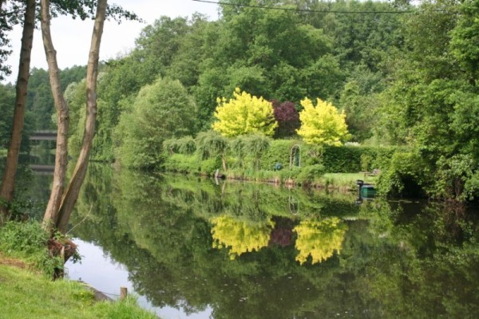
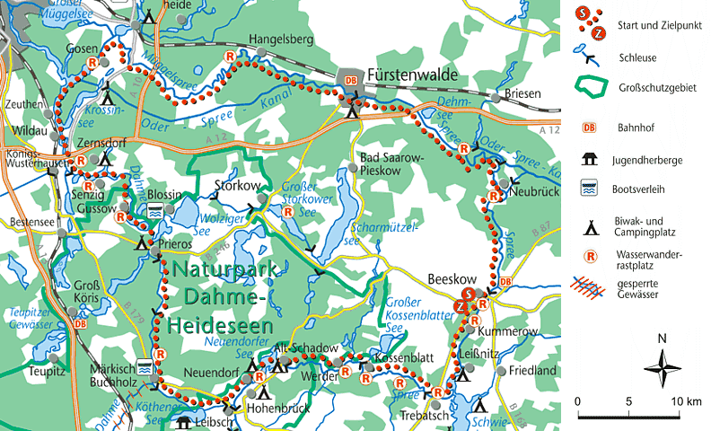
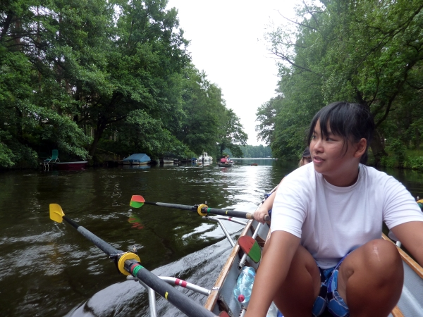

# Pfingstwanderfahrt

## 14.-18. Mai 2027

Die schönste Brandenburger Wanderruderstrecke.

Die Dahme aufwärts bis Märkisch Buchholz, hier wechseln wir auf den Spree-Dahme-Umflutkanal. Dann die Spree abwärts über Beeskow und Fürstenwalde zurück nach Berlin.

Wir starten Freitag Nachmittag in Stahnsdorf. Am Dienstag deponieren wir unsere Boote in Grünau. 
Am folgenden Sonntag rudern wir die Boot zurück nach Stahnsdorf.

Die Strecken sind nicht übermäßig lang, aber etwas Kondition ist nötig.

Vermutlich wird eine Übernachtung im Zelt erfolgen, den Rest übernachten wir in Bootshäusern, teilweise Bettenquartiere.

Diese Fahrt eignet sich besonders für Jugendliche, die auf eine der Sommerfahrten nach Skandinavien mitwollen.

Aber natürlich auch für alle anderen Altersklassen inklusive der Anfänger von 2026.

