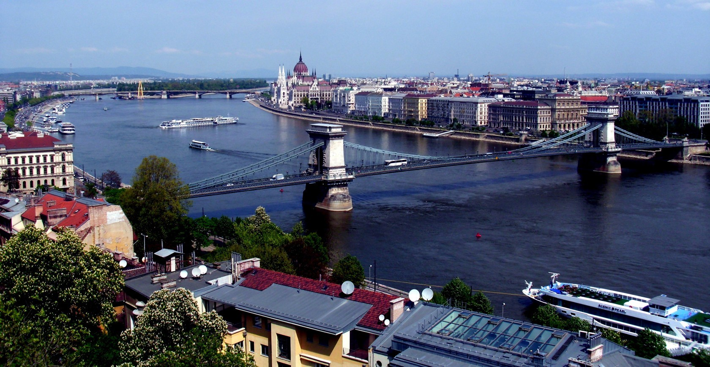
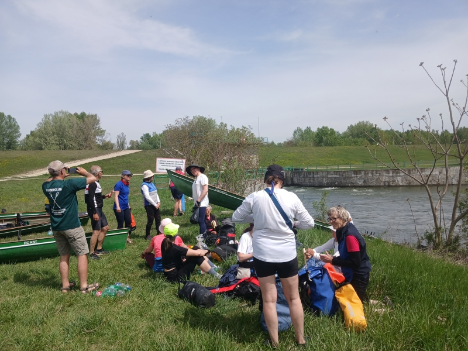

# Österreich - Slowakei - Ungarn - Kroatien

# 19. März - 4. April 2027

## Osterferien, 8 Urlaubstage für Arbeitnehmer nötig 

13 Rudertage, 1 Pausentag in Budapest zur Stadtbesichtigung. In Wien haben wir nur einen halben Tag zur Stadtbesichtigung.

Wir fahren mit Landdienst und mit hoffentlich guter Strömung den Fluss abwärts.
Es gibt nur 2 Schleusen auf der Strecke und leider hinter Bratislava auch 4 Umtragen. Für die Umtragen nehmen wir einen Handwagen mit.

Drei Quartiere sind Mattenlager in Ruderclubs, der Rest sind Bettenquartiere. 

Die Fahrt richtet sich an Ruderer aller Altersklassen. Auch Anfänger aus 2026 können teilnehmen, aber alle Teilnehmer machen bitte keine 3 Monate Winterpause.
Bei 13 Rudertagen ist eine gute Kondition nötig. 
Diese Fahrt bietet sich gut als "Frühjahrs-Traininglager" an. Danach ist man auf jeden Fall fit für die Saison.

