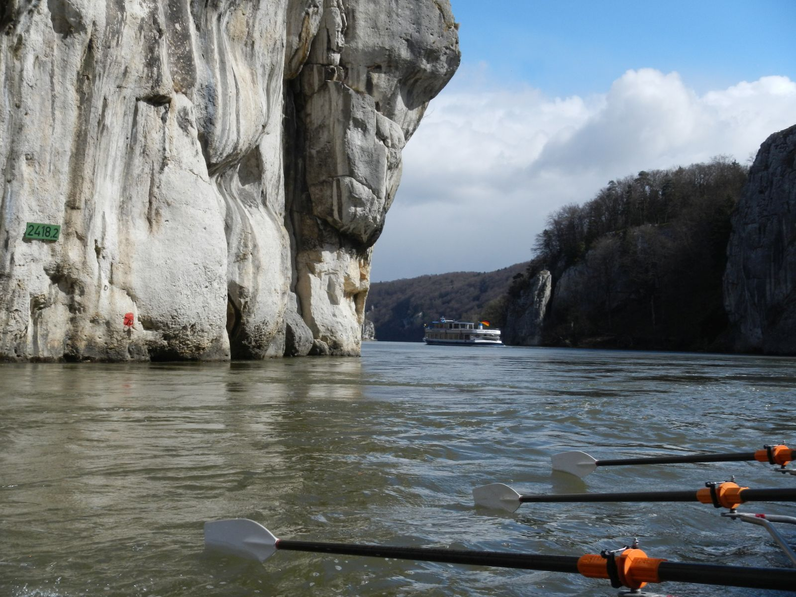

# Österreich - Slowakei - Ungarn - Kroatien

# 8. - 24. Oktober 2027

## Herbstferien, 10 Urlaubstage für Arbeitnehmer nötig 

14 Rudertage, 1 Pausentag in Wien zur Stadtbesichtigung. Ein halber Pausentag in Passau.

Wir fahren mit Landdienst und mit hoffentlich guter Strömung den Fluss abwärts.
Wir starten auf der noch recht kleinen Donau (Landeswasserstraße Bayern) mit vielen Selbstbedienungsschleusen. Rudern durch den Weltenburger Donaudurchbruch und danach durch zahlreiche Gebirgsdurchbrüche hinter Passau. Schlögener Schlinge, Nibelungengau, Wachau, Wienerwald sind landschaftliche Highlights.

Die Quartiere sind meist Mattenlager in Ruderclubs, vermutlich fünf Mal Bettenquartiere. 

Wir haben zwei Abende in Wien, Schönbrunn, Hofburg, Prater, Kahlenberg, Nußdorf sollte man sich ansehen.

Die Fahrt richtet sich an Ruderer aller Altersklassen. Auch Anfänger aus 2026 können teilnehmen.
Bei 14 Rudertagen ist eine gute Kondition nötig. 

