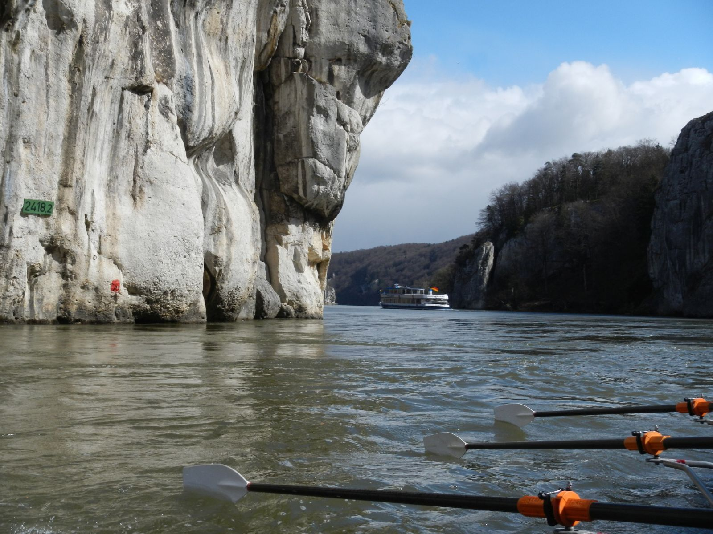
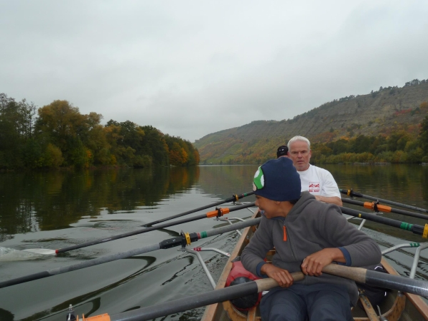
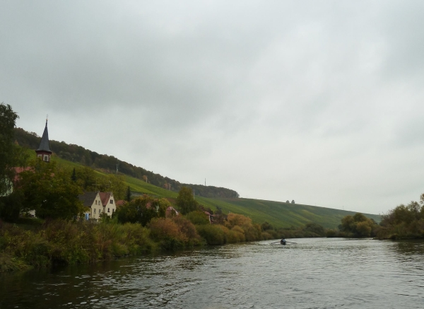

# Donaudurchbruch - Altmühltal - MDK - Main - Rhein

# 8. - 24. Oktober 2027

## Herbstferien, 10 Urlaubstage für Arbeitnehmer nötig 

Wir fahren mit Landdienst zunächst die Donau abwärts, passieren dann beim Kloster Weltenburg den Donaudurchbruch.
Bei Kehlheim biegen wir in den Main-Donau-Kanal ab. Dieser führt zunächst durch das Altmühl, bevor er zur höchstgelegenen Wasserstraße Europas aufsteigt.
Wir passieren Nürnberg, Erlangen und erreichen bei Bamberg den Main.
Diesen geht es abwärts durch den Spessart, vorbei an Schweinfurt, Kitzingen, Würzburg und Marktheidenfeld.
Bei Aschaffenburg geht es in die Rheinebene.
Am letzten Tag erreichen wir den Main.

Sowohl die Landschaft, als auch die Städte am Fluss sind wirklich sehenswert.

Die Fahrt richtet sich an Ruderer aller Altersklassen. Auch Anfänger aus 2026 können teilnehmen.
Bei 15 Rudertagen ist eine gute Kondition nötig. 

