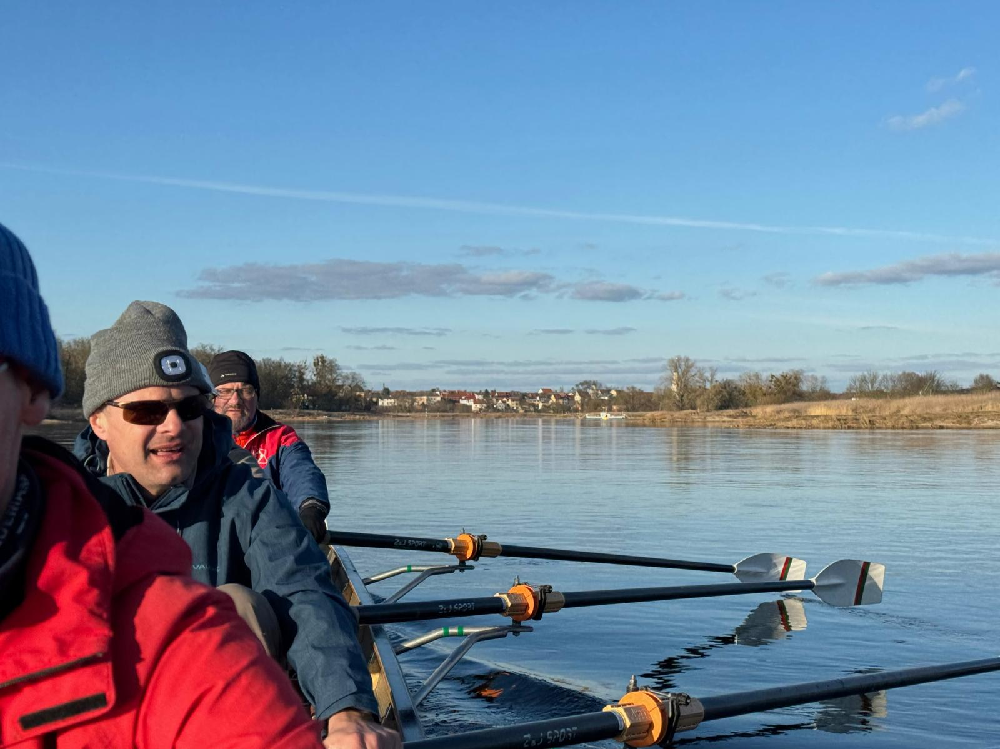

# Elbe Marathon Meißen - Coswig

## 26. - 28. Februar 2027

Die erste Fahrt im Frühjahr um nach dem Winter wieder fit zu werden.
Freitag Anreise nach Meißen, Übernachtung im Bettenquartier, Samstag Ruderstrecke nach Torgau 74 km, Übernachtung auf Mattenquartier, Sonntag nach Coswig 81 km, Rückreise nach Stahnsdorf. 
Die Fahrt findet auch bei widrigen Witterungsbedingungen statt.

Alle Leute die 2027 irgendwelche Marathons rudern wollen, sollten teilnehmen. Außerdem möglichst alle Teilnehmer der Osterfahrt!
Die Strecken sind aber auch für "normale" Ruderer zu schafffen. Die Elbe strömt gut.

