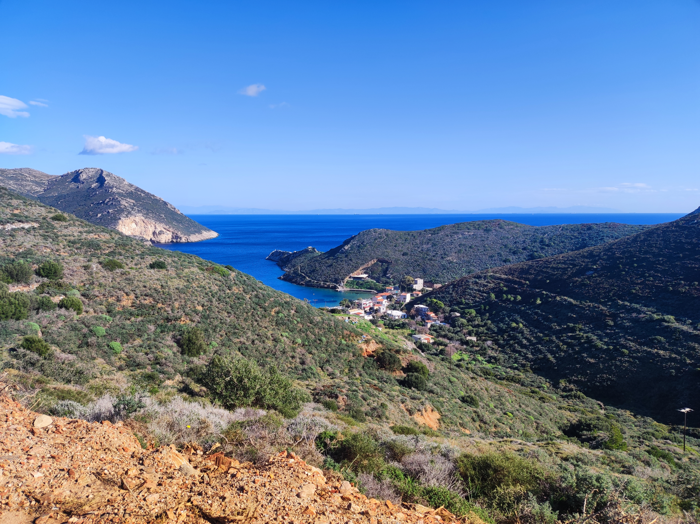

## Geplant für 2027

### Rudern und Antike Ruinen

Gerudert wird an 9-10 Tagen in den tiefen Buchten des Peloponnes. Wir haben Hotels in Ufernähe, meist 2-3 Übernachtungen bevor das Quartier gewechselt wird.
Gerudert wird in Inrigger- Doppel- Dreiern. Man muss daher nur Skullen können. Alle Teilnehmer sollten trainierte Wanderruderer sein, die auch so beweglich sein müssen, dass man an einem Strand aussteigen kann. Es gibt keine Stege. Es muss mit Wellengang gerechnet werden. Wer leicht seekrank wird, nimmt bitte entsprechende Tabletten mit.
Um diese Jahreszeit liegen die Temperaturen üblicherweise bei ca. 20 Grad.
Übrigens sind um diese Zeit die Orangen reif, die wachsen da teilweise direkt an den Straßen.

Die Wanderfahrt wird extrem teuer. Es muss mit ca. 2000 Euro Kosten gerechnet werden.

Wir haben maximal 16 Ruderplätze.

Zusätzlich zum Rudern bieten wir Ausflüge zu touristischen Highlights an. Epidauros, Korinth, Mykene, Argos, Mistras sind in der Nähe.

Der Anhängertransport startet bereits am 14.10. und ist erst am 5.11. zurück. Wir fahren mit der Fähre ab Venedig nach Patras.

Die Ruderer reisen per Flugzeug über Athen an.
