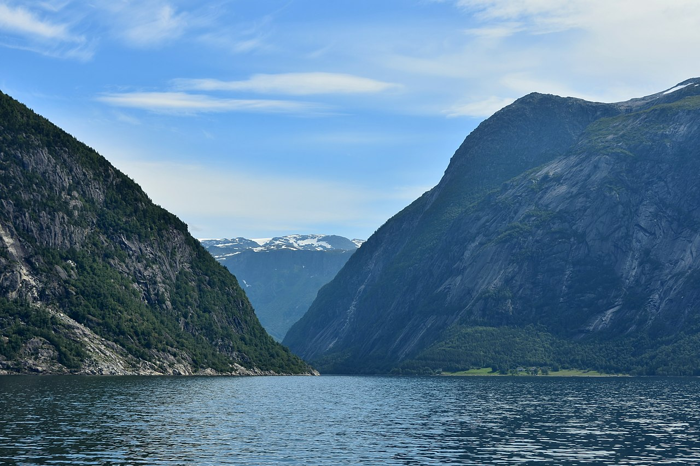
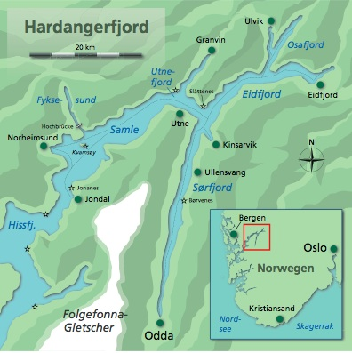

# 01. - 18. Juli 2027

Start am Donnerstag. Anreise über die Fähre nach Bergen. Freitag Mittag in Bergen. Wer Urlaubstage sparen muss reist mit dem Flieger an.

Von Bergen nur 120 km mit dem Auto nach Kinsarvik. Hier haben wir für 7 Nächte Standquartier und machen Tagesfahrten in die umliegenden Fjorde.
Danach wechslen wir für 3 Nächte nach Herand und dann für 4 Nächte nach Ænes.
Alle Quartiere in Hütten mit Betten, kein Zelten.

Frühstück + Abendessen machen wir selbst.

Obwohl wir einen relativ friedlichen Fjord haben, nehmen wir die Inrigger mit. 
Alle Teilnehmer müssen fit genug sein, um schnell aus dem Boot auszusteigen. Anlegen erfolgen meist am Strand. Wassersandalen sind Pflicht.
Gute Kondition ist natürlich Grundvoraussetzung. Tagesetappen zwischen 30 km und 45 km.

Gutes Regenzeug und mehrfach Ruderkleidung versteht sich von selbst.

