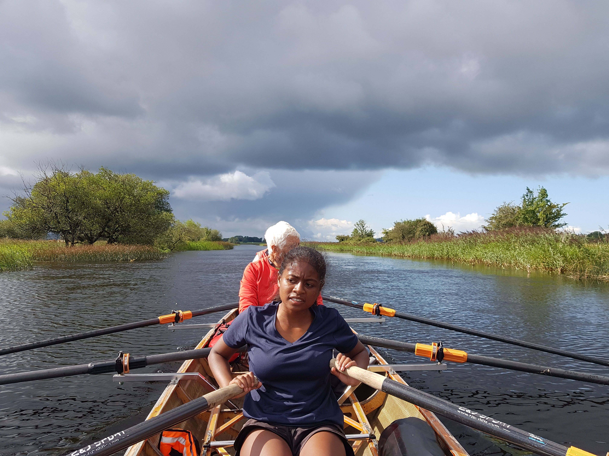

# Irland von Nord nach Süd mit dem Ruderboot

## 29. August - 13. September 2026 

Fähranreise ab 26.8. (Mittwoch) - 14.9. (Montag)

Die Fahrt liegt nicht in den Sommerferien, daher hier keine Teilnahme der Jugend möglich. (es gibt zwei weitere Wanderfahrten in den Sommerferien)

### Rudern auf der grünen Insel

Die beiden größten Flusssystem der Erne und der Shannon sind durch einen Kanal verbunden, so dass man von Nordirland bis ganz in den Süden rudern kann.

Die Kanäle sind schmal, aber alle ruderbar. Auf unser Ruderstrecke von knapp 400km haben wir rund 30 Schleusen (alle Selbstbedienung)
Die seeförmigen Erweiterungen sind teilweise sehr groß und können auch wellig werden. Daher nehmen wir E-Boote mit Abdeckungen mit.

Wir haben eine Landdienst der das Gepäck transportiert. Alle Quartiere sind Hotels/Pensionen mit Betten. Kein Zelten.

Die grüne Insel ist auch deshalb grün, weil es häufig regnet. Das beste Regenzeug ist gerade gut genug! Die Regenmenge im August ist ca. 50% höher als in Berlin.

