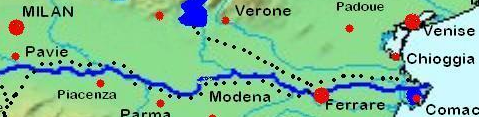

# Ticino - Po - Lagune von Venedig - Sile

## 27. März - 12. April 2026 

### Osterwanderfahrt durch Italien

Anreise am Freitagnachmittag nach Süddeutschland. Samstag geht es weiter nach Pavia am Ticino.
Nach 7 Rudertagen erreichen wir das Po Delta. Hier machen wir zwei Tagestouren zum Ort Adria (liegt im Land) und zur Adria (Strand am Meer).
Dann geht es weiter zum Südende der Lagune von Venedig nach Chioggia.
Die letzten drei Rudertage führen uns über die Lagune zum Flüsschen Sile. Diesen Fluss rudern wir noch einen Tag landeinwärts.
Die Ruderstrecken sind dank guter Strömung machbar. Allerdings ist nicht klar, ob alle Schleusen in Betrieb sind. Zumindest einmal muss vermutlich umgetragen werden.
Wir werden ca. 600 km in 13 Tagen rudern. Eine gewisse Grundkondition ist daher nötig. Bitte keine 5 Monate Winterpause vor der Fahrt.
Die Übernachtung werden meist in Ferienwohnungen oder Hotels erfolgen, möglicherweise ist auch mal ein Mattenquartier dazwischen.
Wann immer möglich kochen wir selbst, sonst werden wir sehr häufig Pizza essen.

