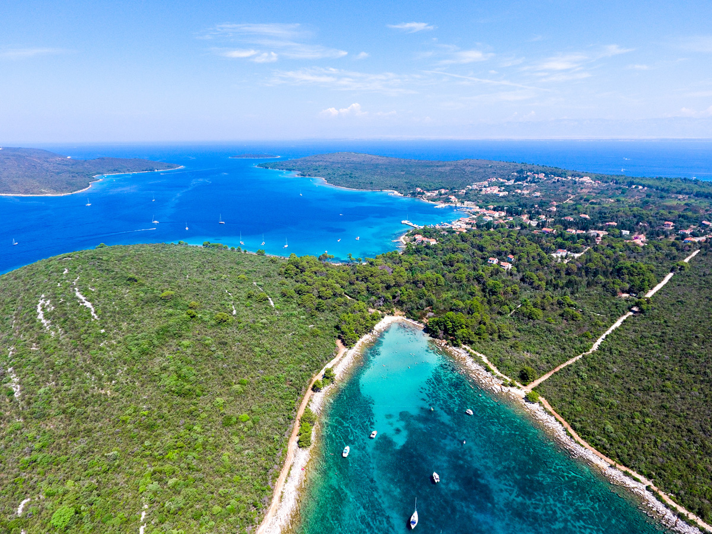

# Kroatien Inseln Ugljan/Pasman

## 17. Oktober - 02.November 2025

Wir haben ein Standquartier auf der Insel Ugljan. Von hier aus machen wir Tagesfahrten in die Inselwelt rund um Zadar.
Die jeweiligen Tagesfahrten werden der Wind- und Wetterlage angepasst. 
Wegen der unzähligen Inseln sind viele verschieden Ruderstrecken möglich.
Um diese Jahreszeit kann man mit Tagestemperaturen um 18-20 Grad und Wassertemperaturen von 20 Grad rechnen.
Wir haben Ferienwohnungen in Strandnähe und werden Frühstück und Abendessen selbst zubereiten.
Die Anreise erfolt mit einer Zwischenübernachtung ab Berlin im Kleinbus. Wir haben 13 Rudertage vor Ort.

