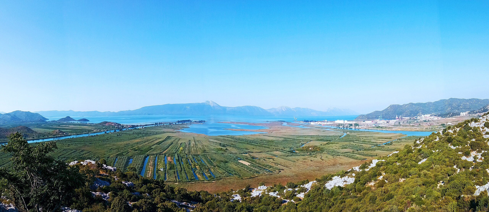
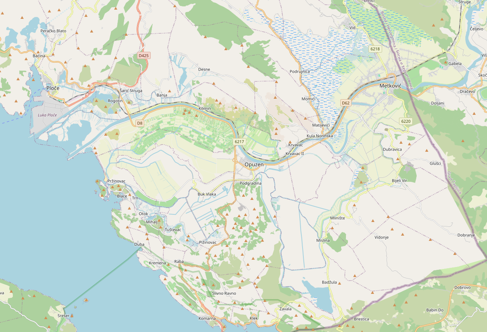

# Kroatien Neretva Delta

## 16. Oktober - 01.November 2026

Wir haben ein Standquartier im Ort Blace an der Mündung der Neretva in die Adria.
Von hier aus machen wir Tagesfahrten ins Delta der Neretva oder in die umliegende Inselwelt.
Die jeweiligen Tagesfahrten werden der Wind- und Wetterlage angepasst. 

Das Delta der Neretva ist das kroatische Anbaugebiet für Zitrusfrüchte.

Um diese Jahreszeit kann man mit Tagestemperaturen um 18-20 Grad und Wassertemperaturen von 20 Grad rechnen.
Wir haben Ferienwohnungen in Strandnähe und werden Frühstück und Abendessen selbst zubereiten.
Die Anreise erfolt mit einer Zwischenübernachtung ab Berlin im Kleinbus. Wir haben 13 Rudertage vor Ort.

