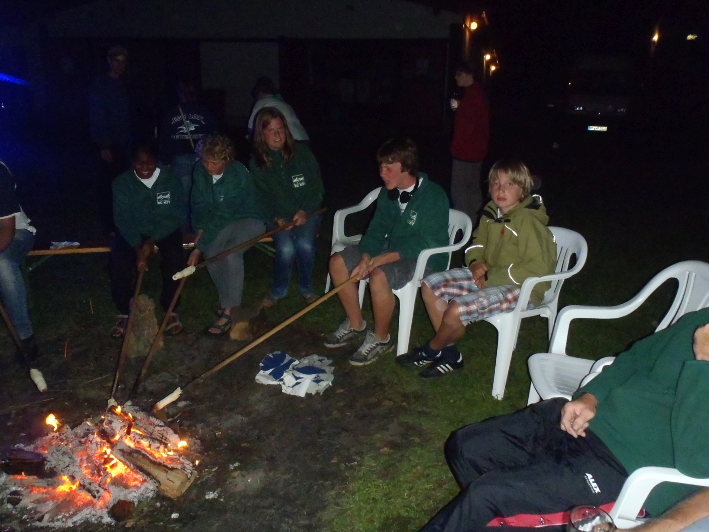

# Wanderrudertreffen 2026 in Lehnin

## 03. - 05. Juli 2026

Das nächste Brandenburger Wanderrudertreffen findet wieder in Lehnin statt.

Wir rudern am Freitagnachmittag bis Ketzin. 
Übernachtung in einer Pension. Das Abendessen kochen wir selbst.

Am Samstag treffen wir in Klein Kreutz zur Mittagspause die anderen Ruderer vom Wanderrudertreffen. (16 km)
Von hier geht es ann gemeinsam nach Lehnin zur großen Party. (15 km)
Unser Quartier liegt am Netzener See, 2km von der Party entfernt. Wir haben drei Ferienhütten mit 12 Betten.

Sonntag geht es nach dem Frühstück zurück nach Werder (47 km).

Am Montag Nachmittag holen wir die Boote aus Werder (25 km)

Die Fahrt richtet sich auch an fortgeschrittene Anfänger. Wir haben beide Nächte Bettenquartiere.

Vom Veranstalter des Wanderrudertreffens gibt es ein T-Shirt für alle Teilnehmer.
