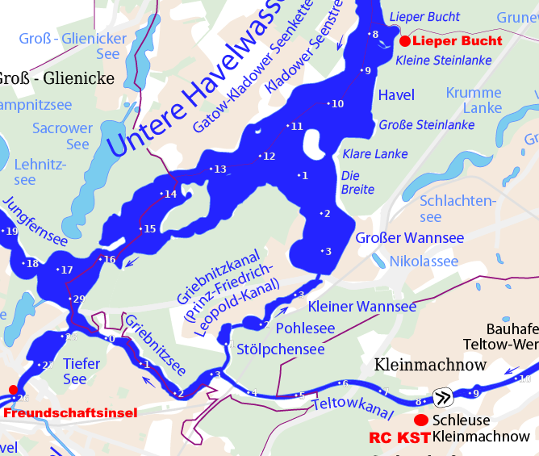

# Wanderrudertreffen 2027 in Stahnsdorf

## 25 Jahre Ruderclub Kleinmachnow- Stahnsdorf- Teltow

## 03. - 05. September 2027

## Freitag 
Anreise ab 15 Uhr
- wer möchte dreht schon eine kleine Runde im Boot
- Abendessen im Ruderclub

## Samstag 
- Frühstück 8 Uhr im Ruderclub
- Tagestour 6- Insel-Runde, 35 km, Mittagspause nach 20 km in der Lieper Bucht
- Abendessen und Party im Ruderclub
 
## Sonntag
- Frühstück 8 Uhr im Ruderclub
- Tagestour Potsdam Freundschaftsinsel, 22 km
- Nachmittag Kuchenbüffet im Club
- Abreise der Gäste

## Allgemeines
- Matten- Quartiere in einer nahe gelegenen Turnhalle
- alternativ Betten- Quartiere in eigener Verantwortung
- Bootsplätze werden gestellt
- Anmeldung bis 4. Juli per Mail: info@wanderrudern.de
- Kosten 65 Euro enthalten sind Mattenquartier, Ruderplatz, Frühstück, Mittagessen am Samstag, T-Shirt

6- Insel Runde: Glienicke, Pfaueninsel, Kälberwerder, Imchen, Lindwerder, Schwanwerder

Mehr Infos folgen!
