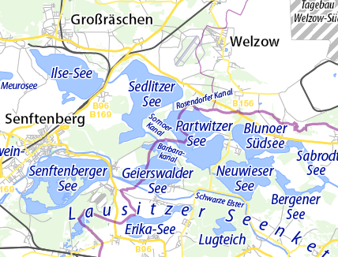

## 2. -4. Oktober

### Erstbefahrung der neuen Seenplatte

Anfang Juli werden die Verbindungskanäle zwischen Partwitzer-, Sedlitzer- und Ilse See eröffnet.
Damit sind fünf Seen (Geierswalder- und Senftenberger See) verbunden und laden zu Roundtouren ein. 
Daraus ergibt sich die größte künstliche Seenplatte Deutschlands.

Wir haben ein Quartier in der Nähe des Geierswalder Sees. Von hier machen wir Samstag und Sonntag Tagesfahrten über die Seenplatte.
Anreise ist am Freitag Nachmittag, Rückreise Sonntag Abend.
Die Ruderstrecken werden bei 30-35 km liegen. Daher ist die Fahrt auch für Anfänger gut geeignet.
Als Highlights gibt es zwei Schiffstunnel zwischen Geierswalder- und Senftenberger See (mit einer Schleuse) mit zusammen 164m Länge.

Wir haben zwei Ferienwohnungen mit zusammen 16 Betten auf einem Bauernhof in Seenähe.
Essen wird selbst zubereitet. Alle Teilnehmer beteiligen sich daran.
Der Bauernhof hat unter anderem Alpakas, wer die nach dem Rudern streicheln möchte, ist hier richtig.

Die Bilder sind teilweise von 2013, als die ersten drei Seen eröffnet werden sollten. In Wirklichkeit waren es nur zwei Seen, was erst kurz vorher bekannt gegeben wurde.
Aber dieses Mal soll es wirklich klappen.

