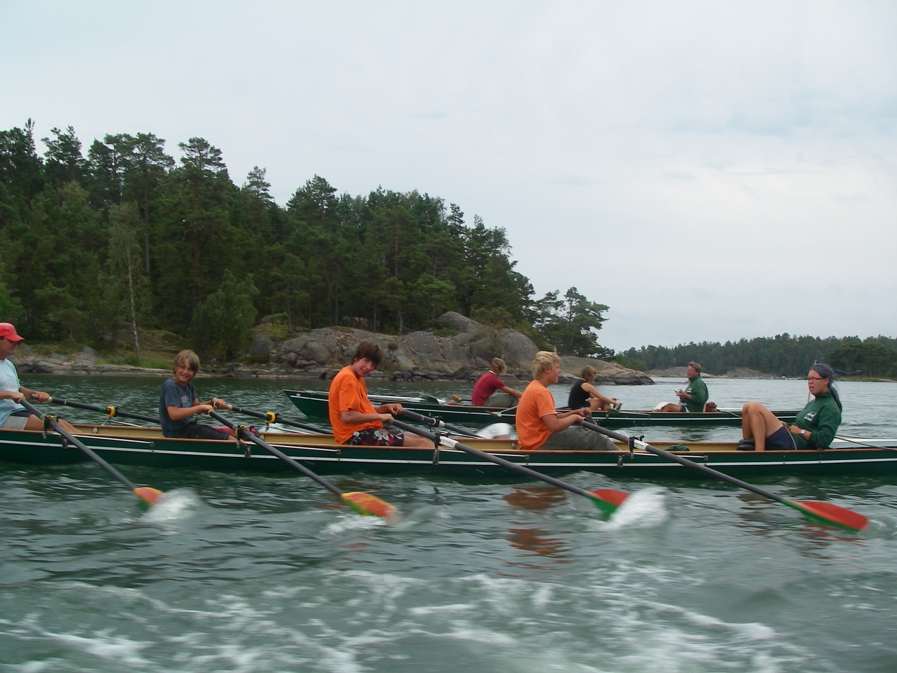

# Mälaren

## 07. - 16. August 2026

### Standquartier auf einer Insel im Mälaren

Anfängerfreundliche Wanderfahrt mit einem Standquartier auf einer Insel im Mälaren.
Gut ausgestattetes Schwedenhaus mit Bettenquartier.

Es werden Tagesfahrten von 35-45 km Länge unternommen.

Die Fahrt liegt in der 5. Schulferienwoche und richtet sich nicht nur an Jugendliche, sondern auch an Erwachsene jede Alters.

Anreise erfolgt am Freitag mit der Nachtfähre ab Rostock. Start in Berlin Freitag gegen 16 Uhr. Wir sind eine Woche später am Sonntag Mittag wieder in Berlin.
