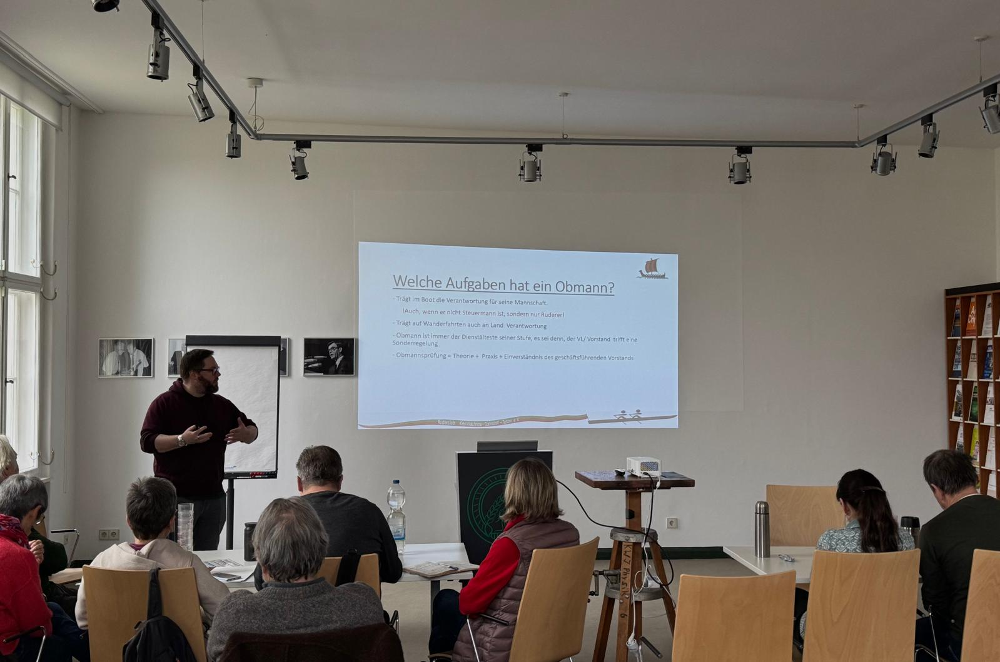

## 10.- 11. Januar 2026

Der Kurs findet im Berlin Dahlem statt. 
Samstag 10-17 Uhr
Sonntag 10-14 Uhr

Der Kurs besteht aus Theorie für die Stufen 1-4.

Am Sonntag findet die theoretische Prüfung statt. Die Abnahme der Prüfung kann auch erfolgen, wenn die Voraussetzungen (Kilometer) noch nicht ganz erfüllt sind.

Die praktischen Prüfungen finden bei passender Gelegenheit in den Folgewochen statt.
Die Teilnahme am Obmannskurs ist auch Anfängern dringend zu empfehlen!
Auch als Auffrischung für gestandene Obleute empfehlenswert.

Die Teilnahme von Gästen aus anderen Vereinen ist ausdrücklich erwünscht. Lehrgangsgebühr für Gäste 50 Euro.

## Warum Obmannskurse?
Grundsätzlich sollten alle Ruderer die Regeln auf dem Wasser kennen. 
Schifffahrtszeichen, Vorfahrtsregeln, Schallsignale, sicheres Rudern in unterschiedlichen Situationen wie bei Wind und Wellen oder Strömung gehören dazu.
Auch das umsichtige Verhalten bei Havarien sollte jeder kennen.
Leider ist das bisweilen recht selten der Fall. 
Auf jeden Fall sollte jedoch der Obmann diese Dinge beherrschen.
