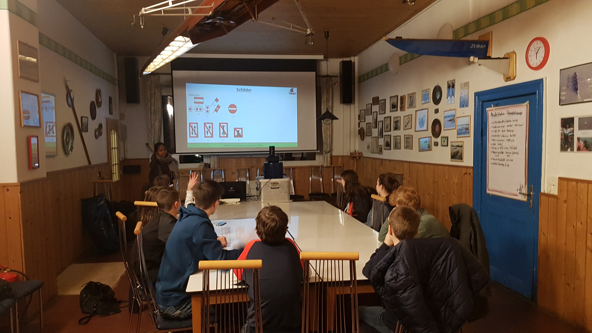
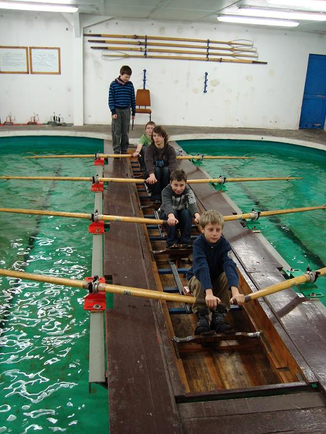

## 8.-10. Januar 2027

Der Kurs findet im Ruderclub Werder (Bettenquartier) statt. Abfahrt am Freitag um 16 Uhr am Bootshaus. Wir sind am Sonntag Nachmittag zurück. Kosten des Kurses ca. 60 Euro (Verpflegung, Unterkunft, Ein­tritt Funbad).

Der Kurs besteht aus Theorie für die Stufen 1-4, sowie einer praktischen Ausbildung im Ruder­kasten und auf dem Ruder­ergometer.

Am Sonntag findet die theoretische Prüfung statt. Die Abnahme der Prüfung kann auch erfolgen, wenn die Voraussetzungen (Kilometer) noch nicht ganz erfüllt sind.

Die praktischen Prüfungen finden bei passender Gelegenheit in den Folgewochen statt.
Die Teilnahme am Obmannskurs ist auch Anfängern dringend zu empfehlen!
Dies ist eine wichtige Sicherheitsschulung, daher sollten alle Kinder und Jugendliche teilnehmen.
Auch als Auffrischung für gestandene Obleute empfehlenswert.

