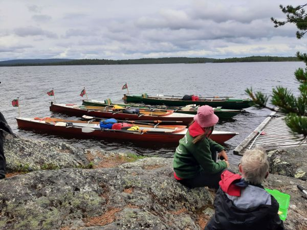

## Obmannskurs Stufe 5

## Samstag, 24. Januar 2026    

## Kleinmachnow 10 - 16 Uhr

Wir bieten zum ersten Mal einen Obmannskurs für das Rudern auf dem Meer an.

Wir lehnen uns an die Dänischen Bestimmungen an, aber dieser Kurs berechtigt nicht dazu sich in Dänemark ein Boot auszuleihen.

Aber man erwirbt Kenntnisse zum Meeres-Rudern. Der Kurs besteht nur aus Theorie, Praxis im Sommer auf der Ostsee, oder im Herbst auf der Adria.

[Adria](/ausschreibungen/Kroatien2026)

Alle Leute die im Jahr 2026 an Meereswanderfahrten teilnehmen wollen, sollten an dem Kurs teilnehmen. Selbst wenn sie nicht als Obmann mitfahren.

Natürlich sind auch alle anderen Interessierten eingeladen, mit zu machen.
