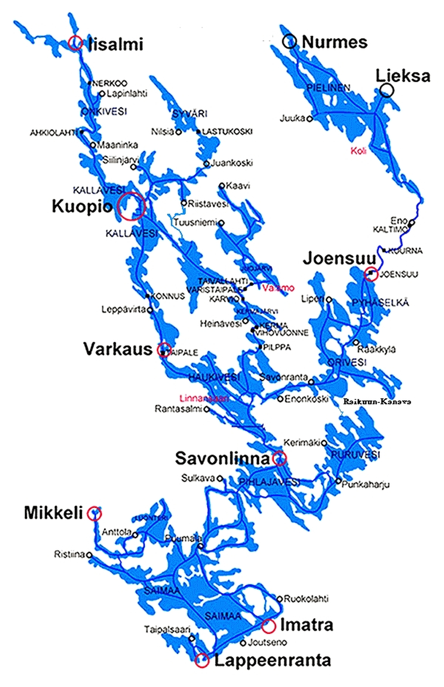

# Jugendwanderfahrt auf der größten Seenplatte Europas

# 30. Juni. - 25. Juli 2027

Start am Mittwoch Mittag zur Fähre nach Rostock, weiter nach Stockholm, Fähre nach Helsinki.

Wanderfahrt für Jugendliche und jung gebliebene Erwachsene

Die Hälfte der Übernachtungen im Zelt, der Rest in Hütten. 

Übernachtung auf einsamen Inseln

Kein Landdienst, alles Gepäck wird in den Booten transportiert

19 Rudertage, Sonnenuntergang 23 Uhr, Sonnenaufgang 3 Uhr

Alle 3-5 Tage Einkaufsmöglichkeiten

[Saimaa 2025](/berichte/2025/saimaa2025)   [Saimaa 2023](/berichte/2023/finnland_saimaa_2023)    [Saimaa 2019](/berichte/2019/finnland_saimaa_2019)    [Saimaa 2016](/berichte/2016/finnland_saimaa_2016)   
[Saimaa 2014](/berichte/2014/finnland_2014_blog)   [Saimaa 2011](/berichte/2011/finnland_saimaa_2011)   [Saimaa 2007](/berichte/2007/saimaa_pielinen_07)

