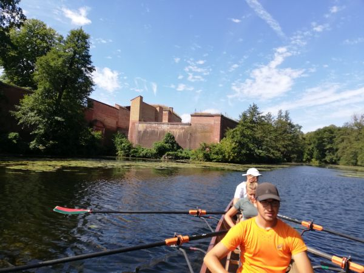

# Spandau + Tegel

## 19. Juni - 21. Juni 2026

Wir rudern am Freitagnachmittag nach Spandau (25 km). Das Ziel liegt direkt oberhalb der Spandauer Schleuse.
Übernachtet wird für 2 Nächte beim Ruderklub Brandenburgia auf Bettenquartier.

Wer lieber zu Hause schlafen möchte, der U-Bahnhof Haselhorst ist genau 1000m entfernt.

Wir haben eine Küche und einen Grill zur Verfügung. Samstagabend wird gegrillt.
Der Rudersteg liegt am Spandauer See mit Blick auf die Zitadelle Spandau.
Vom Steg kann gebadet werden.

Samstag machen wir eine Tagestour auf den Niederneuendorfer und auf den Tegler See (30 km), sowie einen kleinen Ausflug rund um die Zitadelle.
Sonntag geht es wieder zurück nach Stahnsdorf.

Die Strecken sind kurz, so dass auch Anfänger problemlos mitrudern können.

