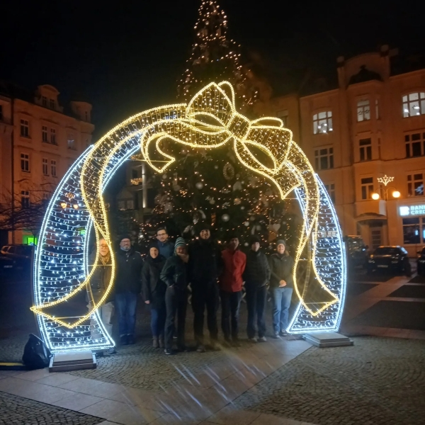

# Ausflug zum Spandauer Weihnachtsmarkt 

## 12./13. Dezember 2026

Wir rudern am Samstag nach Spandau (23 km), lagern hier unsere Boote bei einem Ruderclub und gehen auf den Spandauer Weihnachtsmarkt.
Rückreise nach Hause mit der BVG.
Sonntag früh treffen wir uns wieder in Spandau und rudern zurück nach Stahnsdorf.

Eine Übernachtung ist nicht vorgesehen. Wer gerne in Spandau übernachten möchte, meldet sich bitte.

Die Strecken sind kurz, so dass auch Anfänger problemlos mitrudern können.

Für alle die noch Wanderruderkilometer für ihren Wanderruderwettbewerb benötigen, die Fahrt sind 46 km.

