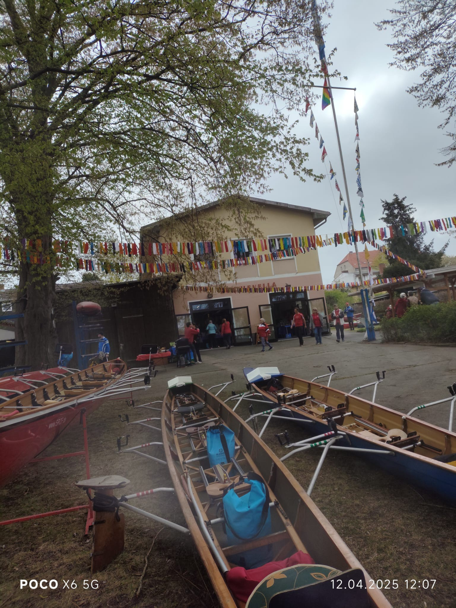

# Treffen der Berliner und Brandenburger Ruderer

## Samstag 28. März 2026

Wir starten am Samstag früh um 10 Uhr und rudern zur Rudererparty nach Spandau.
Hier machen wir eine länger Pause, treffen us mit den anderen Ruderern und stärken uns für den Rückweg.

Die Strecke beträgt 2 x 21 km.
Damit ist das eine gute Trainingstrecke, für alle die dieses Jahr vielleicht auch mal richtige Wanderfahrten mitmachen wollen.
Oder auch als gutes Training für die Ruderer die auf der EUREGA Anfang Mai starte wollen.
Oder für alle die das Kuchenbüffet bei Hevella genießen wollen.

Bitte meldet euch bei Luise an.

