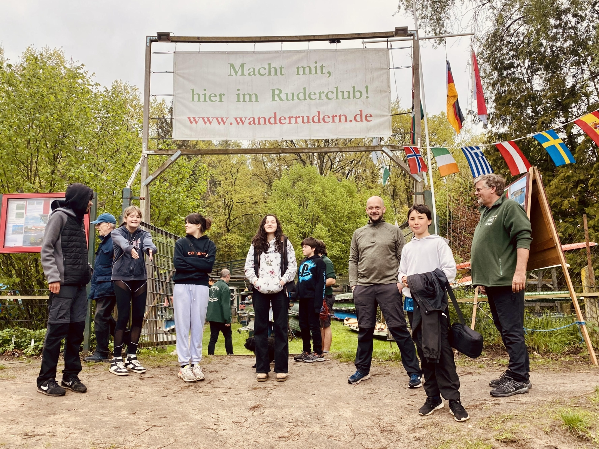
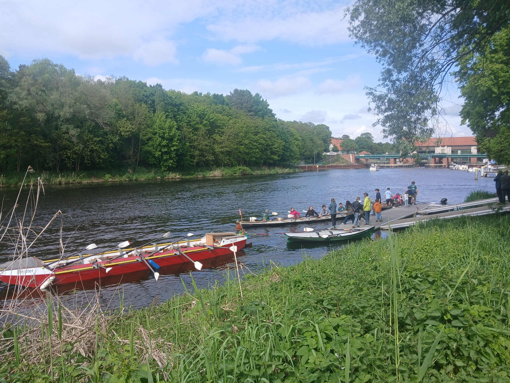

# Proberudern für Alle

## 25./26. April 2026     11-18 Uhr

Informationen über das Rudern im Club

für Erwachsene jeden Alters und Kinder ab 10 Jahren

Proberudern für alle,  auch wenn sie noch nie in einem Boot gesessen haben

Kaffee / Kuchen / Grill / Salate / Getränke

Alle Interessierten sind herzlich eingeladen.

Bootshaus: Stahnsdorf, Bäkepromenade (Teltowkanal, 200 m unterhalb der Schleuse)

[Ruderkurse für Anfänger starten nach dem Tag der offenen Tür](./club/anfaenger/ruderkurse)
