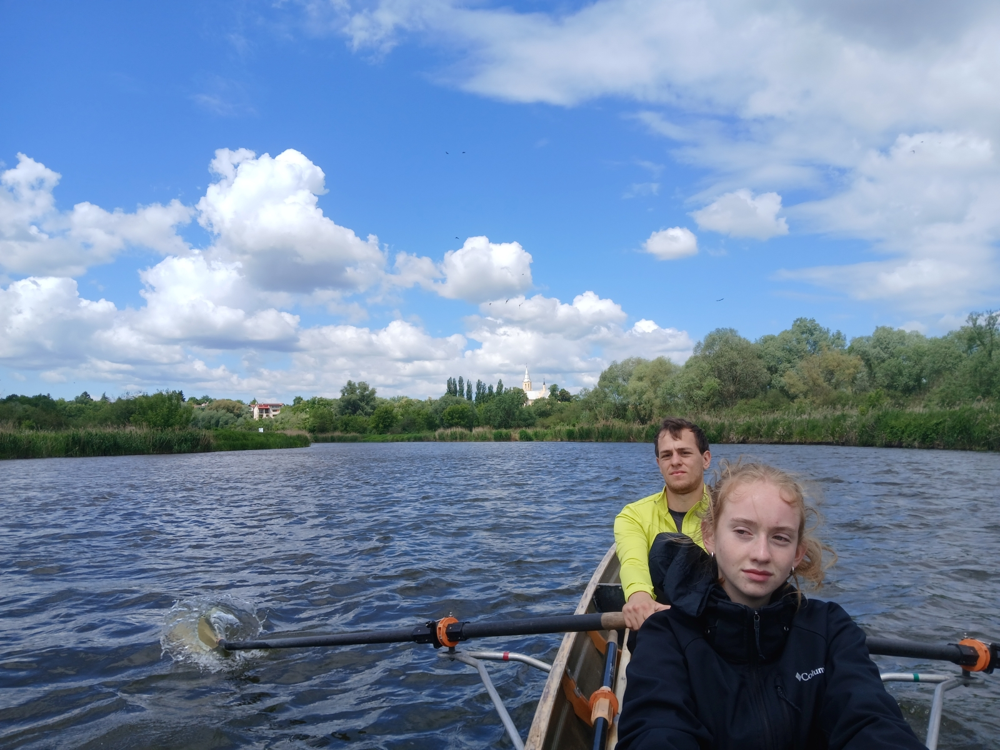

# Warthe Kolo - Gorzow

## 13. - 17. Mai 2026

Dies ist eine Extrem-Marathonfahrt. Wer gemütlich Wanderrudern will, der melde sich bitte Pfingsten an. Diese Fahrt ist absolut ungeeignet für Anfänger und Untrainierte.
Es werden 390 km in 4 Rudertagen gerudert.
Wenn sich jemand als Landdienst anmelden möchte dann ist er natürlich willkommen.
Bettenübernachtung und sehr gute Verpflegung im Preis enthalten.

Mittwoch Anreise nach Kolo

Donnerstag Pyzdry, 94 km, Übernachtung Obstbauer

Freitag Posen, 108 km, Übernachtung Blooms Hostel

Samstag Chorzepowo, 106,5 km Übernachtung Bauer

Sonntag Gorzow, 81,5 km Rückreise mit Auto und Bahn

