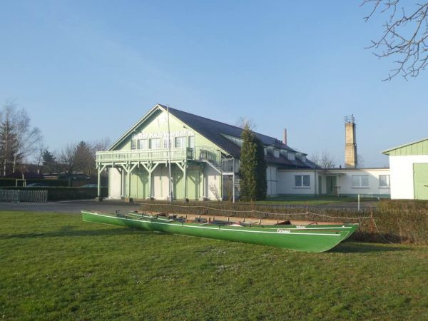

## 06.- 08. März 2026

Anfängerfreundliche Wanderfahrt nach Werder. Wir starten am Freitagnachmittag und rudern zum Ruderclub Werder. (25 km)
Hier übernachten wir zwei Nächte auf Bettenquartier.

Samstag rudern wir eine Tagestour nach Ketzin (ca. 30km).

Sonntag geht es wieder zurück nach Stahnsdorf (ca. 25 km).

2 Leute müssen am Samstag an der Vorstandsversammlung des Landesruderverbands in Werder teilnehmen, der Rest geht einfach rudern.

 
