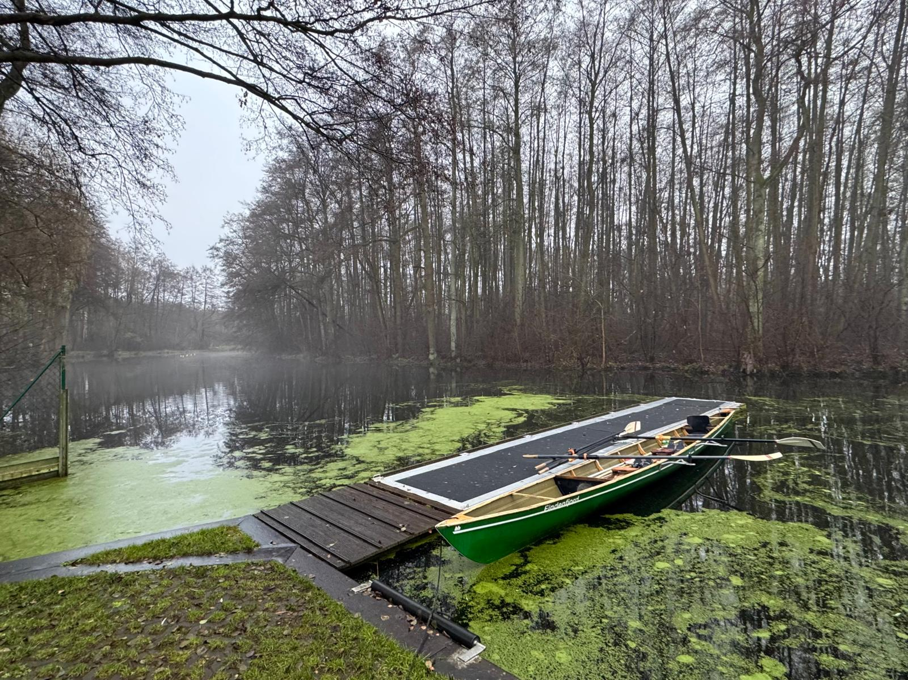
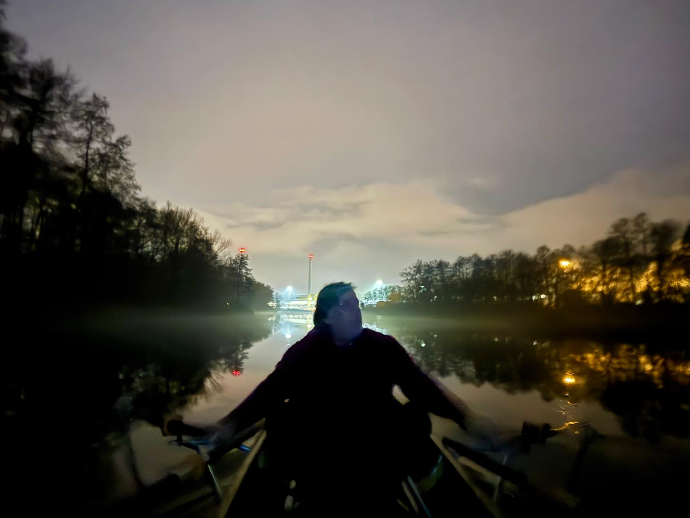

Zweimal im Jahr muss der Vorstand zur Vorstandsversammlung des LRV Brandenburg.
Die Dezember- Versammlung war dieses Jahr in Birkenwerder.
Man kann natürlich mit dem Auto hinfahren, echte Wanderruderer kommen mit dem Boot.

Freitag ging es mit zwei Booten die Havel aufwärts, durch die Spandauer Schleuse nach Haselhorst.
Wir übernachteten auf Mattenquartier beim Märkischen Wassersport.

Das Boot, das zur Sitzung musste startete extrem früh, um pünktlich um 11 Uhr beim Ruderclub Birkenwerder zu sein (aber immerhin erst gegen Sonnenaufgang). Das zweite Boot holte unsere Steuerfrau etwas später in Birkenwerder ab und ruderte mit ihr zurück.
Für die beiden Vorsitzenden ging die Sitzung bis 17 Uhr. Danach im Dunkeln zunächst als Einer mit Steuermann bis Hennigsdorf. Hier stieg LingLing (per S-Bahn angereist) zu, so dass der restliche Rückweg bis Haselhorst wieder schneller ging.

Am Sonntag ruderte die gesamte Mannschaft entspannt nach Stahnsdorf zurück.
Mit dem Wetter hatten wir Glück, kein Regen und immerhin 5-8 Grad Plus.

Ein wichtiges Thema bei der Vorsitzenden-Versammlung war die Sicherheit auf dem Wasser. 

Selbstverständlich rudern wir im Dunkeln mit vorschriftsmässiger Bootsbeleuchtung. Und noch der Hinweis: Für das Rudern im Dunkeln ist Ortskenntnis und Rudererfahrung nötig!

Alle drei Nachtruderer hatten Obmannsscheine für Dunkelfahrten (Stufe 4) auf solchen Gewässern.
