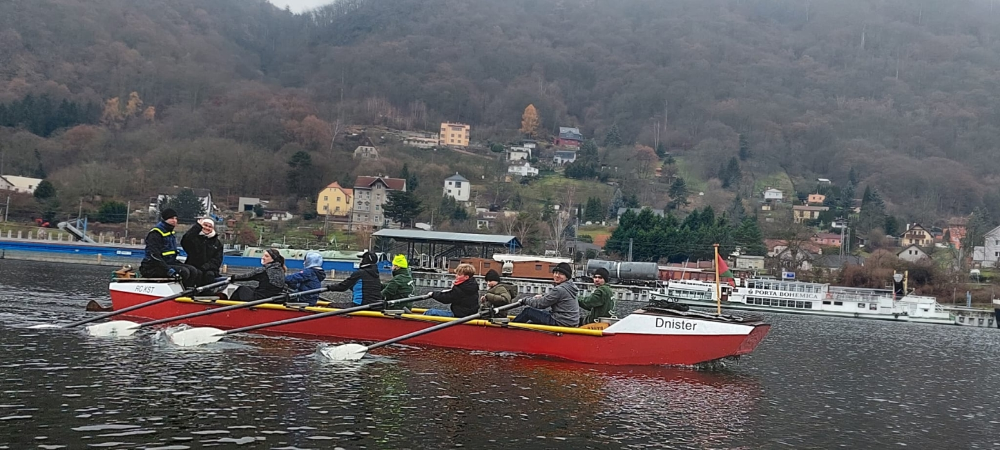
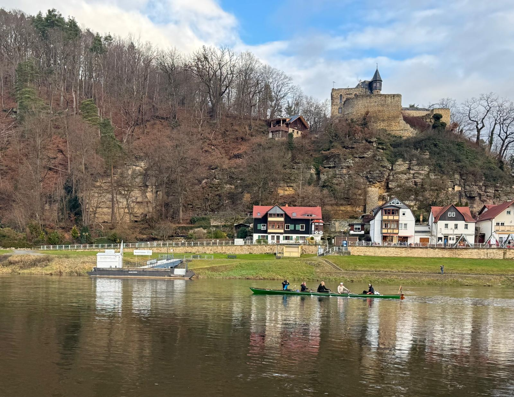

Die traditionelle Adventsfahrt auf der Elbe erfolgte zum ersten Mal nach 14 Jahren wieder mit einer Barke. Damals noch mit einem Eigenbaus aus zwei D-Vierer Rümpfen, jetzt mit unserer eigenen, echten Barke.
Da wir nun mit 2 Anhängern zur Elbe mußten zwei Zugmaschinen nach Lovosice anreisen. Dank kompletten Chaos der Deutschen Bahn kam sogar noch ein drittes Fahrzeug dazu. Andernfalls hätten die letzten Teilnehmer sechs Mal umsteigen müssen.

Am Abend trafen sich alle 21 Teilnehmer im örtlichen Sporthotel, bzw. im Dönerladen. (das letzte Lokal was noch offen hatte). Im Gegensatz zum Vorjahr waren nur wenig Gäste dabei, dafür aber zwei Erwachsene Anfängerinnen und drei Anfänger aus dem Kinderbereich.

Da die Boote direkt neben dem Hotel eingesetzt werden können und genug Profis dabei waren, kamen wir früh los.

Die ersten 19 Kilometer ging es bei abnehmender Strömung durch das Gebirge bis zur Schleuse Usti. Direkt über der Schleuse thront die Burgruine Schreckenstein.
Der Schleusenwart mußte die gewaltige Kammer erst hochschleusen, was eine kleine Zwangspause ergab. Bei 0 Grad nicht gerade kuschlig, aber die Ruderer waren gut ausgerüstet.
Danach ging es mit sehr guter Strömung weiter durch Usti und weiter nach Decin. Unterwegs gab es die erste Gierfähre zu bewundern, die aber glücklicherweise regungslos am Ufer lag.
In Decin wurden die Boote neben dem winzigen Kanusteg herausgenommen und die Barke mit Leinen und Anker gut vertäut.
Da unser Hotel ein angeschlossenes Schwimmbad hatte, war die Jugend gut beschäftigt, der Rest genoss den Weihnachtsmarkt.
Zwei der drei Autos und beide Bootsanhänger wurde von einigen Freiwilligen nach Decin gebracht. Da die Schandauer Brücke wieder passierbar war, ging das recht zügig.
Um 19 Uhr saßen alle im reservierten Restaurant "Rathaus" und genossen das Tschechische Abendessen.

Sonntag ging es wieder früh aufs Wasser. Das Wetter war immer noch grau, aber inzwischen deutlich wärmer. Beim Start 5 Grad, am Ziel sogar 8 Grad und es blieb trocken. Zum Ende kam soagr die Sonne heraus.
Da heute keine Schleuse im Weg war konnten sich die Boote eine Pause in Rathen gegenüber der Bastei gönnen.

Trotz fehlendem Steg beim Pirnaer Ruderverein bekamen wir die Boote problemlos aus dem Wasser. 
Die Barke wurde direkt oberhalb des Rudervereins am anderen Ufer ausgesetzt. Eine sehr schöne Rampe eines örtlichen Yachtclubs.

