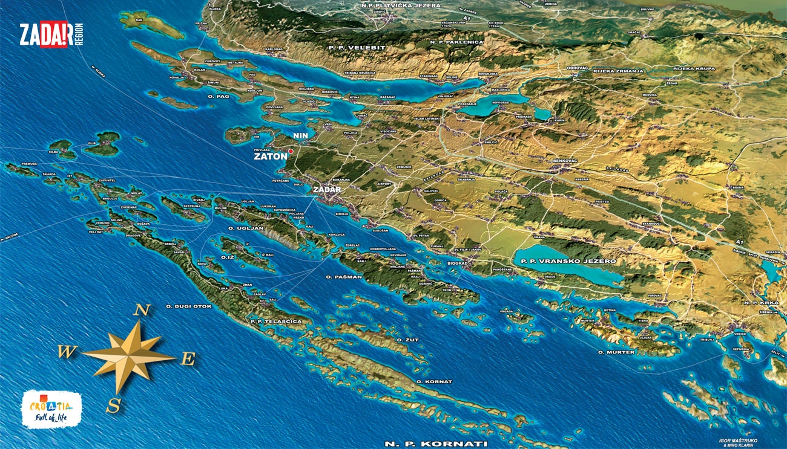

# Kroatien Inselwelt rund um Zadar

Wellen, Wind und Wowopeh – Zwei Wochen Rudern in Kroatien

Von Heike Lüttich
Auf dem Meer bin ich noch nie gerudert, deshalb reizt mich das Angebot auf der
DRV-Seite für eine Wanderfahrt in Kroatien. Und das ab Mitte Oktober, so dass ich
die Hoffnung habe, den Sommer um zwei Wochen verlängern zu können. Zumindest
verspricht die Wettervorhersage Tagestemperaturen um die 20 Grad und meistens
trockenes Wetter.

Während die meisten mit zwei Autos und dem Bootshänger von Kleinmachnow aus
anreisen und in Regensburg im Ruderverein übernachten, kommen die beiden
Süddeutschen, also Timo und ich, mit dem Flugzeug direkt nach Zadar, Fahrtenleiter
Stefan holt uns auf Ugljan am Fährhafen ab. Ugljan ist Teil der Inselkette vor der
kroatischen Küste, die wir unsicher machen wollen. Unser Quartier ist ein großes
Ferienhaus mit komfortabler Ausstattung, dazu kommt eine kleine Ferienwohnung,
die hundert Meter entfernt liegt.

Am ersten Tag schnuppern wir zunächst ein bisschen aufs Meer hinaus. Zehn
Ruderer, verteilt auf drei Inrigger mit Bug- und Heckabdeckung. Zwei Boote fahren
also mit Loch. Wir setzen in der Bucht Mala Lamjana ein, einsteigen im flachen
Wasser. In der Bucht ist das Meer ziemlich friedlich, es ist ein wunderbares Gefühl,
über petrolblaues Wasser zu gleiten, über uns blauer Himmel, es wird angenehm
warm, sodass ich kurzbehost rudere. Dabei hatte ich eigentlich schon abgeschlossen
mit den kurzen Hosen für dieses Jahr! Wir steuern die Nachbarinsel Iž an und
umrunden sie. Plötzlich wird ganz kurz eine dreieckige Rückenflosse sichtbar, taucht
aber gleich wieder ab. Sekunden später und ein paar Meter weiter noch eine –
Delphine! Vier sind es insgesamt, die vor der Inselküste im Wasser tollen. Jeder
versucht, ein möglichst gutes Foto zu machen, aber die Delphine sind meistens
schneller als die Finger auf den Auslösern. Außer für einen biologisch nötigen
Landgang bleiben wir die ganze Zeit im Boot, auch gevespert wird auf dem Rollsitz.
Am Abend, nach 46 Kilometern, beschwert sich meine Kehrseite dann doch etwas,
aber da muss sie durch.

Für den nächsten Tag ist ein ehrgeizigeres Ziel angesetzt – durch die Inselkette
durch zu den Kornaten, also der äußersten Inselgruppe bis auf die inselfreie Adria
hinaus – einmal in Richtung Italien gucken! Immer wieder sehen wir die Lücke
zwischen den Inseln, hinter der nur noch das offene Meer liegt, aber irgendwie
kommt sie nicht näher ... Wir ziehen, was das Zeug hält, aber heute ist das Meer
rauer und wir müssen über eine längere Strecke auf den Windschatten der Inseln
verzichten. Unser Boot tanzt auf den Wellen, die das Rudern nicht gerade einfacher
machen. Für Ruderer wie mich, die eher stille Wasser gewohnt sind, ist es
anstrengender als sonst. Und egal, wie weit wir kommen, die Ansage lautet, um halb
zwei umzudrehen, schließlich müssen wir alles wieder zurückrudern. Und genauso
kommt es: ohne den „Durchbruch“ zu erreichen, kehren wir um und sind erleichtert,
als „unsere Bucht“ in Sichtweite kommt. Dass in der Nacht auch das Bett noch
schwankt, versteht sich fast von selbst.

Ugljan ist nur durch eine schmale Meerenge von der Nachbarinsel Pašman getrennt,
über die eine Autobrücke, die Ždrelac-Brücke, führt. Die ist am dritten Tag das Ziel,
aber der Wind macht den Booten einen Strich durch die Rechnung. Er bläst so stark,
dass Rudern nur noch eine Qual ist. Die Boote klatschen immer wieder heftig von der
Wellenkrone aufs Wasser, die Ruderer werden durchgeschüttelt, zwischendurch
hängt das Steuer frei in der Luft. Gottseidank haben wir ein Standquartier und
müssen keine bestimmte Strecke bewältigen, also Umkehr und ruderfreier
Nachmittag.

Der neuerliche Versuch am nächsten Tag gelingt. Wir rudern unter der Brücke nach
Pašman durch, überqueren die Meerenge und fahren an der Küste von Pašman
entlang. Auf der Backbordseite sehen wir Zadar, an Steuerbord gleiten Pinienwälder,
Olivenhaine und Ferienhäuser vorbei. Unser Ziel ist der Yachthafen des Ortes
Pašman, wo wir an der Kaimauer anlegen, die Boote festzurren und Kaffee trinken
gehen. So gestärkt treten wir den Rückweg an und sind um fünf wieder in unserem
Quartier.

Über Nacht ist der Wind stürmisch geworden und hat Regenwolken herangeweht.
Schon der abendliche Check der Wettervorhersage hat deutlich gemacht, dass
Rudern heute ausfallen muss. Stattdessen beschäftigen sich alle irgendwie, lesen,
schlafen oder gehen spazieren und erkunden den Ort Kali. Einkaufen fürs
gemeinsame Essen muss natürlich auch sein. Jeden Abend kocht jemand anderes,
die Bandbreite reicht von Krautfleckerl über Spaghetti Carbonara oder Bolognese bis
zu Toast Hawaii und Gemüsecurry. Es finden sich auch immer genügend Schnippler,
Tischdecker, Spüler und Aufräumer.

Am Freitag steht eine besondere Aufgabe an: wir müssen pünktlich am Fährhafen in
Preko sein, um einen neuen Ruderer abzuholen, selbstverständlich standesgemäß
mit Ruderbooten. Lars soll um zwölf mit der Fähre ankommen und wir schaffen es –
just in time! Zehn vor zwölf sind wir da. Sein Gepäck wandert ins Boot, dann steigt
Lars ein und wir rudern zu einem Kaffeestopp im nächsten Hafen. Danach frischt der
Wind wieder auf. Als wir durch die Meerenge zwischen den beiden Inseln durch sind
und zu unserer Bucht nach rechts abbiegen, kommen auch noch heftige Wellen
dazu. Schön rudern geht definitiv anders! Wir kommen nicht so recht von der Stelle,
könnte man meinen, aber unser Steuermann Martin beruhigt uns, dass das nur so
aussieht, aber trügt. Ich fühle mich so durchgeschüttelt und gestaucht, dass auch
meine Hirnzellen durcheinandergeraten und die Buchstaben verdrehen – statt
„Popoweh“ habe ich deshalb „Wowopeh“. Wieder schwankt die Matratze und
schaukelt mich in den Schlaf.

Die Wettervorhersage, die Stefan am Abend konsultiert hat, sorgt dafür, dass wir
etwas später frühstücken als sonst, schließlich sagt die Petrus-App, es sei kein
Ruderwetter. Aber nichts ist so unbeständig wie eine solche Vorhersage. Der Wind ist
nur ein laues Lüftchen, die Sonne scheint, also satteln wir die Hühner wenigstens für
eine kurze Fahrt Richtung Iž. Als wir unsere Bucht verlassen, nimmt der Wind zu. Wir
kämpfen mit Stauwellen, Steuern ist eine kühle Angelegenheit. Gottseidank hat jedes
Boot eine extra Decke für den frierenden Steuermann dabei. Auf dem Rückweg
tröpfelt es auch noch ein bisschen. Gegen Mittag legen wir die Boote wieder in
unserer Bucht auf die Wiese. 

Am Nachmittag gibt es ein kleines Kulturprogramm.
Stefan hat im Reiseführer vom Kloster Sv. Kuzme i Damjana gelesen, auf einem
Hügel oberhalb von Tkon auf der Insel Pašman. Es stammt aus dem 14. Jahrhundert
und ist das einzige noch von Mönchen bewohnte Benediktiner-Kloster in Kroatien.
Ausnahmsweise erkunden wir Ruderer also eine Sehenswürdigkeit mit dem Auto.
Die Klosteranlage und die Kirche sind nicht groß, uns begegnet auch nur ein
einzelner Mönch. Die Aussicht vom Hügel ist allerdings fantastisch.

Die Umstellung auf Winterzeit wirft unseren bisherigen Tagesablauf durcheinander.
Bisher sind wir meist gegen fünf zurückgekehrt, da ist es jetzt aber schon dunkel.
Stefan beschließt, noch einen Ausflug in Richtung Kornaten und Adria zu versuchen.
Dafür müssen die Boote aber schon in aller Herrgottsfrühe aufs Wasser, sonst reicht
die Zeit nicht für den Rückweg im Tageslicht. Diesmal klappt es, Wind und Wellen
halten ihre Kräfte zurück. Alle sind überwältigt von der traumhaften Insellandschaft
und dem Blick ins blaue Nichts, hinter dem Italien liegt.

Viele der Inselküsten, die wir bisher gesehen haben, fallen steil ins Meer ab, der helle
Saum der Inseln ist in aller Regel Fels. Am Ufer recken viele Steine ihre Spitzen aus
dem Wasser, es ist gar nicht so einfach, einen Anlegeplatz zu finden, sei es auch nur
für eine biologische Pause. Aussteigen mit Wasserschuhen ist sowieso obligatorisch.
Stefan will uns allerdings zeigen, dass es durchaus auch Sandstrände gibt. Die Insel
Vrgada ist berühmt dafür, sie ist unser nächstes Ziel. Was für eine Wohltat, den Kiel
des Bootes beim Anlegen sanft auf den Sand aufzusetzen statt auf spitzkantige
Steine achten zu müssen! Wie überall ist das Wasser ganz klar, winzige Wellen
kräuseln die Oberfläche und den Sand. Der Strand ist nicht breit, die Strandbar
schon im Winterschlaf. Über die meterhohe Felskante, die den Strand begrenzt, ragt
eine halbe Baumwurzel. Eine Pinie scheint sich mit aller Kraft festzukrallen, um nicht
abzustürzen. Ohne Badetouristen ist der Strand eine echte Idylle, die wir aber nicht
allzu lange genießen können – schließlich dräut der frühe Sonnenuntergang. Zurück
nach Mala Lamjana wäre zu weit, diesmal ist der Plan, bis Tkon auf Pašman zu
rudern. Dort nehmen wir im Yachthafen die Boote über die glitschige Bootsrampe aus
dem Wasser und lagern sie über Nacht am Kai. Der Bus bringt uns zurück nach Kali
und am nächsten Morgen wieder zu den Booten.

Der Rückweg erfreut uns mit einiger Herausforderung für die Steuerleute. Permanent
drücken Wind und Wellen die Boote aus der gewünschten Richtung, pausenlos muss
man korrigieren, um den Kurs zu halten. Als die Umrundung von Pašman komplett
ist, sprich, wir unter der Brücke durchgefahren sind, wird es richtig heftig. Meterhohe
Wellen, immer wieder klatschen die Boote aufs Wasser, es schwankt ordentlich, im
Bug bliebt niemand ganz trocken. Erst nach dem erneuten Richtungswechsel, als wir
auf unsere Bucht zufahren, wird es ruhiger. Diese 25 Kilometer haben sich angefühlt,
als wären sie doppelt so weit gewesen.

Am nächsten Tag, unserem vorletzten Rudertag mahnt die Petrus-App zu erhöhter
Vorsicht. Fahrtenleiter Stefan gibt deshalb vor, dass nur die Obleute steuern dürfen.
Erst ist alles noch ganz ruhig und sogar warm auf dem Wasser, aber als wir am
Industriehafen vorbei Richtung Nordwesten abbiegen, um an Ugljan entlang zu
schippern, beginnt der Tanz auf den Wellen. Der Wind zeigt uns, was er drauf hat,
und peitscht das Meer ordentlich. Die Wellen spielen mit uns, manche sind bis zu
zweieinhalb Meter hoch. Die Steuerleute müssen kämpfen, um die Boote im richtigen
Winkel darüber zu bugsieren. Die Blätter gleiten durchs Wasser wie durch Butter –
manchmal ist die allerdings kühlschrankhart. Ein eventuell nötiger Landgang ist
absolut illusorisch, angesichts der Steine am Ufer bei dem Wellengang viel zu
gefährlich. Nach zweieinhalb Stunden entscheidet Stefan, die Fahrt für den Tag
lieber zu beenden. Windstärke 6 – 7 ist kein Pappenstiel. Die enge Einfahrt in das
Miniatur-Hafenbecken ist bei den Verhältnissen eine Herausforderung, aber alle
schaffen es. Die Boote bleiben über Nacht neben dem Becken an Land liegen. Wir
machen uns zu Fuß auf den Weg zum nächsten Bus.

Eigentlich hätten wir gestern um die Insel herumfahren sollen, jetzt gehen wir die
zweite Hälfte dieser Tour halt am letzten Tag an – bei wesentlich günstigeren
Bedingungen. Ohne Wind und Wellen gehen Einsetzen und Ablegen viel schneller.
Und das bisschen Wind, das uns erwartet, als wir um den nördlichsten Zipfel der
Insel herum sind, kann uns nach gestern nur noch ein leises Lächeln entlocken. Wir
passieren den Ort Ugljan und freuen uns weiter an der grünen Küste. In Lukoran gibt
es in der Bucht mitten im Ort einen Sandstrand, optimal zum Anlegen, Abriggern und
Aufladen. Immerhin haben wir auf die Art fast die ganze Inselküste gesehen, es
fehlen nur etwa fünf Kilometer zur vollständigen Inselumrundung. Und fast alle haben
mindestens 300 Kilometer mehr auf dem Tacho nach den zwei Wochen.

