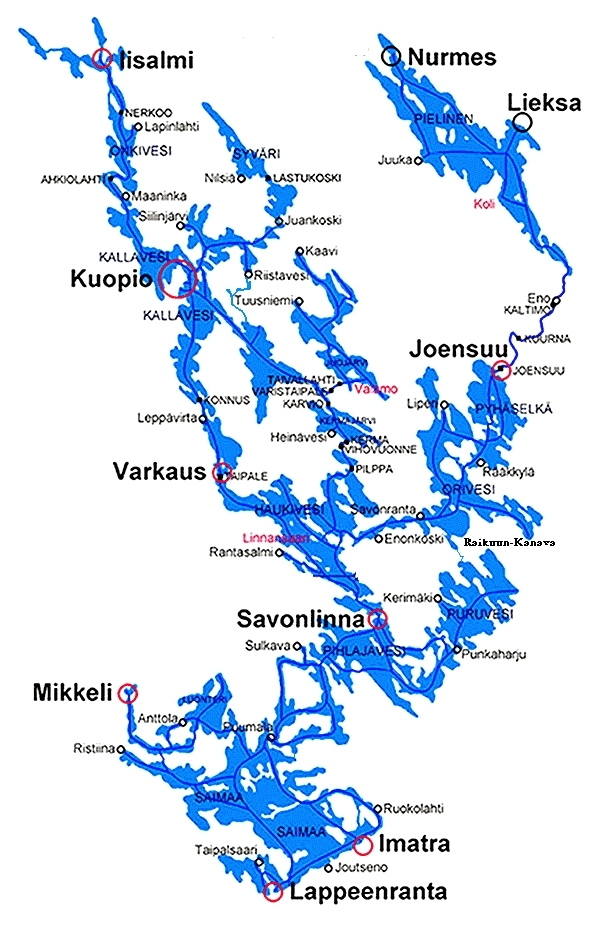

## 762 km in 19 Rudertagen

Für ne Berliner (Stadt)Pflanze unvorstellbare Weiten im Ruderboot auf dem Saimaa 

Unsere diesjährige Sommerwanderfahrt ging auf die Saimaa Seenplatte im Südosten Finnlands.
Gleich nach der Zeugnisausgabe machten wir uns mit 3 Booten auf dem Anhänger und 9 Leuten im Auto auf den Weg nach Rostock, um die Nachtfähre Richtung Schweden zu nehmen, dann weiter auf leeren Straßen nach Stockholm zur Fähre nach Helsinki und schließlich nach Puumala, wo wir die Boote vom Hänger nahmen, diesen samt Auto dort für die nächsten 3 Wochen abstellten und unser Abenteuer starten konnte

… allerdings war vor dem Abenteuer erst einmal viel Gepäckverstauen angesagt. Unmengen an haltbarem Dosenbrot, Tortellini und Büchsenfleisch sowie unsere Zelte, 3 große Töpfe, die Pumpe für das Filtern des Seewassers und die Gasflasche samt Brenner (falls Regen ein Lagerfeuer auf den Biwakplätzen unmöglich machen würde) und dazu natürlich noch die privaten Packsäcke, gefüllt mit Matte, Schlafsack und dicken sowie 

- ganz wichtig – Regensachen.

Mitgebrachter Süßkram benötigte auch einiges an Platz, da wir ja nur alle 3 – 4 Tage mit Einkaufsmöglichkeiten in kleinen Orten auf unserer Runde rechnen konnten.
   
Es lagen auf unserer insgesamt 762 km langen Rundtour durch die vielen Inseln einige interessante Orte, z. B. die Wasserburg Olavlinna, das Kloster Uusi Valamo, in deren einfachen Klosterzellen wir einmal übernachteten und das einfache aber reichhaltige Abendessen und Frühstücksbuffet genießen konnten.

Auch das Erkunden der steinernen Aufschüttungen und noch erhaltenen Bunker der Antisowjetischen Verteidigungslinie (Salpa Linie) waren sehr interessant. 

Auf unseren Routen mussten wir auch schon mal mit Schwung und Ruder lang durch 2 Meter breite Wellblechrohre, die als Durchfahrt unter Straßenbrücken dienten und den Steuerleuten viel Spaß machten.
Immer den richtigen Abzweig zwischen irgendwie sich sehr ähnelnden Inseln zu finden, ist manchmal trotz der mitgebrachten super Seekarten gar nicht so leicht. 
Auch öffnen sich in der üppigen Natur schmale Durchfahrten erst, wenn man sehr nahe herangerudert ist, von weitem sind sie fast nicht zu erkennen.

Auf unseren Biwakplätzen waren die Holzlager immer gut gefüllt und die Stämme wurden von unseren Jugendlichen mit Säge und Axt fix zerkleinert, sodass unser abendliches warmes Essen schnell gekocht werden konnte. 
Sehr willkommen und lecker waren auch die Blaubeeren, die üppig auf allen Biwakplätzen wuchsen und gerade reif waren.

Toll war der Blick über die weiten Seeflächen zwischen den Inseln und die herrliche Ruhe, da nur sehr selten Motorboote oder Ausflugsschiffe unseren Weg kreuzten. Schade ist, dass uns keine Saimaa Ringelrobbe begegnete, obwohl wir ja in deren Schutzgebieten unterwegs waren.

Wieder zurück in Puumala kamen die Boote auf den Hänger und wir machten uns auf den Weg nach Hause. Auf der Fähre von Helsinki nach Stockholm fielen wir natürlich über das reichhaltige Buffet her, sodass wir die in den 3 Wochen eventuell verlorenen Pfunde vermutlich gleich wieder zurückhatten.

Lars hat uns aus seinen Aufnahmen noch eine schöne bildliche Zusammenfassung geschnitten:

