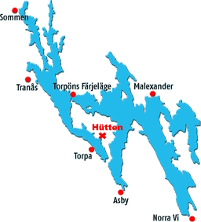

Die letzte Ferienwoche zog es uns dann noch einmal in den Norden. Dieses Mal aber nur bis Schweden.
Freitagabend ging es in Rostock auf die Fähre nach Trelleborg, Samstag früh erreichten wir Trelleborg. Der schwedische Zoll störte etwas das entladen der Fähre, da sie einen Alkoholtest von jedem Fahrer verlangte. Als könnte man auf dieser Fähre etwas anderes machen, als sofort schlafen zu gehen.

Gegen Mittag erreichten wir Oskarshamn an Ostküste. Hier lieferten wir einen gebrauchten C-Vierer ab. Als Dank durften wir mit zwei Inriggern eine Runde durch die Schären drehen.
Danach ging es weiter zum Sommen. Wir hatten zwei traditionelle, gut ausgestattete Ferienhäuser nur 50m vom See enfernt. Wir luden die Boote an einem Strand ab und richteten uns ein.

Am Sonntag ging es früh aufs Wasser, da wir bis zur äußersten Nordwestecke des Sommen rudern wollten. Zunächst noch bewölkt und mit wenig Wind ruderten wir zur Ortschaft Sommen. Nach einer Pause am örtlichen Badestrand ging es wieder südwärts. Ein Abstecher nach Tranas (der größtn Stadt der Gegend) erforderte es einen Flusslauf aufwärts zu rudern. Der strömte zwar kaum, war mit 3 km dann aber doch länger als gedacht. Wir machten im Yachthafen fest und liefen zum örtlichen Lidl zum einkaufen.
Damit war die Strecke mit 52 km dann doch etwas länger als erwartet.

Der nächste Tag ging es über riesige Seeflächen zum äußersten Südende. Leider kam der Wind dann doch aus der falschen Richtung, so dass die Strecke sehr anstrengend wurde. Wir waren nur froh, dass wir unsere E-Boote mit Abdeckungen dabei hatten. Im Yachthafen von Norra Vi gab es sogar ein Café, geöffnet Donnerstag Nachmittag. Wir hatten Montag, knapp daneben.
Der Rückweg ging wesentlich entspannter, obwohl die Steuerleute ziemlich aufpassen mussten 17km freie Fläche in Windrichtung ist auch bei Schiebewind nicht nur schön.

Der Dienstag brachte extremen Dauerregen, so dass wir uns für das Kulturprogramm entschieden. Das Luftwaffenmuseum in Linköping ist wirklich sehenswert. Sehr viele Flugzeuge aus der Anfangszeit der Fliegerei um 1910 und natürlich moderne Maschinen. Ein besonderer Gag war für 50er,60er,70er,80er Jahre Flugzeuge aus dieser Zeit und dazu Zeitungsmeldungen aus dieser Zeit und ein jeweils ein Wohnzimmer im Stil der Zeit eingerichtet.

Der nächste Tag brachte wieder gutes Wetter, wenn auch Morgens die Feuchtigkeit der Regengüsse als Nebel aufstieg. Aber es wurde wieder warm.
Wir machten uns auf den zweiten nördlichen Arm des Sommen zu erkunden. Bei Boxholm verlässt der Fluss Svartan mit einem großen Wehr den See. Natürlich mit einer EU konforme Fischtreppe und natürlich mit keiner sinnvollen Umtragestelle. Am Ende liegt ein verlassener Industriehafen und eine Mariana ohne jeden Service. Daher suchten wir uns einen kleinen Strand für unsere Pause.
Nach 47 km waren wir wieder zurück bei unseren Ferienhäusern.

Mit 24 Grad und Sonne wurde es heute noch wärmer. Da der Wind relativ stark aus Süd bließ, machten wir einen Abstecher zum mittleren Nordarm. Hier schützten uns einige Inseln etwas vor dem Südwind. Leider gab es hier nicht einmal eine vernünftige Anlegestelle. Auf dem Rückwind sprangen wir auf Westkurs von Inseldeckung zu Inseldeckung und umrundeten Tarpön nördlich. Die erhoffte Eisdiele am nördlichen Ende der Insel Tarpön (Torpöns Fäjelage)hatte heute natürlich geschlossen. Dafür hatte immerhin das Natur- und Heimatmuseum geöffnet. Freier Eintritt, nicht sehr groß, aber durchaus einen Blick wert.
Nach 43 km waren wir wieder zurück.

Für den letzten Rudertag war am Nachmittag Gewitter angesagt. Daher nur eine kurze Strecke über Malexander (Bar natürlich geschlossen, Eisverkauf am Campingplatz auch zu) ging es wieder nördlich von Tarpön zur Eisdiele, die heute sogar wirklich geöffnet hatte. 
Von da weiter zu unseren Hütten. Die Boote abgeriggert und aufgeladen, eine halbe Stunde danach brach das Gewitter los.

Die Rückreise nach Trelleborg verlief problemlos. Die Sehenswürdigkeiten von Trelleborg (Wikingerburg und Pizzaladen) waren schnell abgehakt. Um 23 Uhr fuhr unsere Fähre in Richtung Rostock.

Eine schöne entspannte Wanderfahrt. Dank des Standquartiers mit ordentlichen Hütten, deutlich entspannter als eine Bewegungswanderfahrt mit Zelten.

