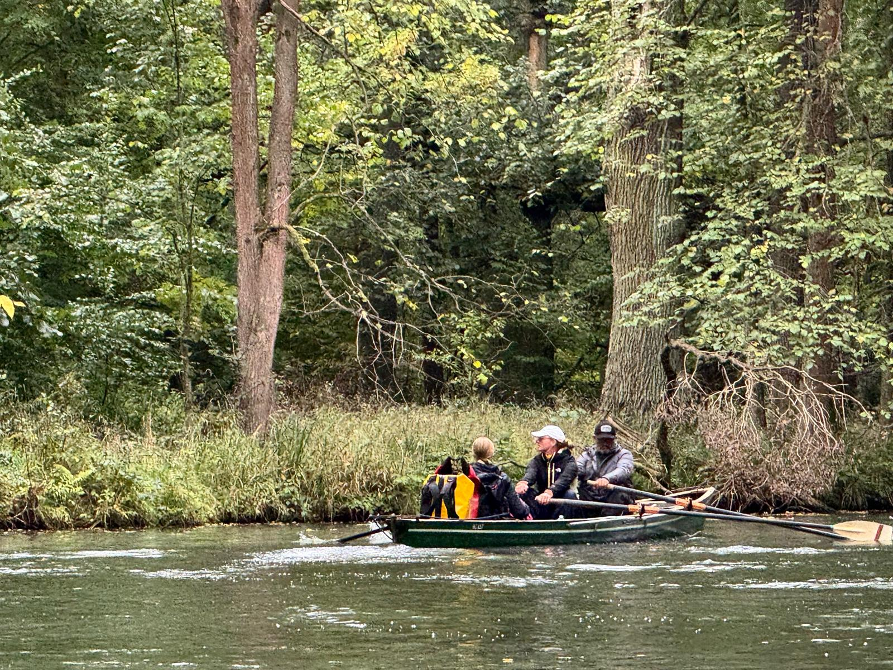

# Spreewaldfahrt im Oktober

Das lange Wochenende Anfang Oktober machten wir uns wieder auf den Weg in der Spreewald.
Als echter Wanderruderer starteten wir in Stahnsdorf, den Teltowkanal aufwärts bis zum Bootshaus von Pro Sport in Wendenschloß.

Am nächsten Morgen ging es, bei sonnigem Herbstwetter weiter über die Grünauer Regattastrecke. Mit einem kleinen Umweg zur Schleuse Wernsdorf und weiter über den langen Zug zurück zur Dahme, durch die Schleuse Neue Mühle nach Prieros.
Wegen der kulinarischen Erlebnisse der letzten Jahre im FDJ Lager Prieros, hatten wir uns dieses Mal für ein anderes Quartier entschieden. Das Hotel am Fluss war nicht nur von den Zimmern besser, sondern lag auch vom Abendessen mehrere Klassen über dem FDJ Lager.

Am dritten Tag verliess uns leider unser Glück mit dem Wetter. Bei leichtem Nieselregen und heftigem Wind ruderten wir die Dahme weiter aufwärts. Glücklicherweise ist der Fluss hier durch viel Wald geschützt, so dass der Wind uns nicht allzu sehr erwischte.
Bei Märkisch Buchholz trifft die Dahme auf den Spree-Dahme-Umflutkanal. Nach dem passieren der beiden Bootsschleppen erreichten wir den Köthener See. Hier merkte man erst wie stark der Wind wehte. Glücklicherweise ging es gleich danach in den Spreewald. Wind spielte da keine Rolle mehr, darüber hinaus schützte uns das Blätterdach vor dem immer weder auftretenden Regenschauern.
Das geplante Ziel an der oberen Puhlstromschleuse hielt noch eine zusätzliche Herausforderung für uns bereit. Die erst in den letzten Jahren sanierte Schleuse war defekt. Der Hebel für das obere Schütz war verbogen und nicht mehr richtig nutzbar. Daher mussten wir unsere Boote im Unterwasser über eine steile Treppe heraus nehmen.
Wir lagerten die Boote im Wald und machten uns auf dem Weg zu unserem 2,5km entfernten Hotel in Krausnick. Ein sehr schönes Haus, leider ziemlich teuer, insbesondere das Abendessen.

Sonntag gönnten wir uns ein Taxi, um wieder zu den Booten zu kommen. Nachdem wir die 100l Wasser aus den Booten bekommen hatten, ging es weiter. Heraus aus dem Unterspreewald, nach Lübben und in den Oberspreewald. Zunächst noch bei Sonne, die sich aber bald verzog. Die Runde durch den Oberspreewald begleiteten uns die ersten leichteren Schauer, die aber gegen Nachmittag massiv zunahmen.
Beim Aussetzen der Boote am Pumpwerk hinter Lübbenau wurde der Regen dann heftiger.
Glücklicherweise war unser Abholdienst (noch einmal Dank an Wolfgang) pünktlich da, so dass wir halbwegs trocken ins Auto kamen und nach Hause fahren konnten.

Quartiere am langen Wochenende im Spreewald zu buchen ist extrem schwierig. Die Wirte hoffen alle auf Wochengäste. Das dies, dieses Jahr wohl gar nicht geklappt hat lag vermutlich am Wetter. Wir haben den Spreewald noch nie so leer erlebt, 10 Kanuten und 4 Kähne waren alles.

