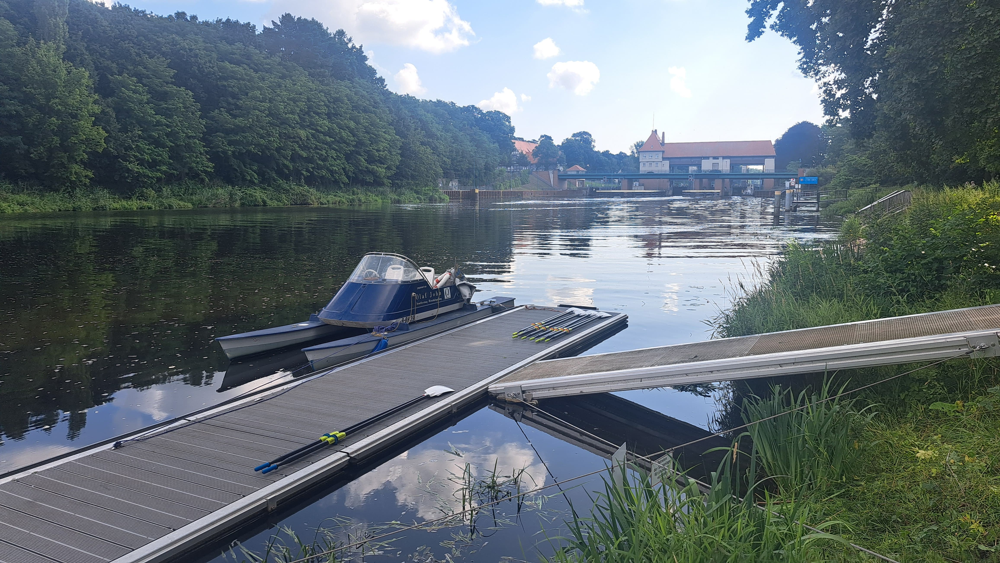

Am Wochenende vom 18.7. bis 20.7. wurde von Nirina ein Kurs organisiert, bei dem zwei Trainer aus dem Rheinland anreisten, um uns einen Einblick in fortgeschrittene Rudertechnik zu geben.
Ziel dieses Pilot-Projektes war es, den Teilnehmern einen selbstkritischen Blick in die eigene Technik zu geben, aber auch Wege aufzuzeigen, dieses erlangte Wissen an den Rest des Clubs in einer angemessenen Weise weiterzugeben.

Der Einstieg erfolgte am Freitag Abend in einer ersten Gesprächsrunde, wo Ziele gesteckt und Ansprüche an den Kurs thematisiert wurden.
Nach einer kurzen Ausfahrt am Freitag inklusive erster Aufnahmen beendeten wir den ersten Tag des Kurses.

Samstag morgen war zuerst das Thema der Vermittlung des Ruder-Leitbildes allgemein.
Im Anschluss wurde den restlichen Tag an der individuellen Technik der Teilnehmenden gearbeitet, sowohl im Boot, als auch anhand aufgenommener Videos.
Nur eine kurze Mittagspause wurde sich gegönnt.

Der Sonntag wurde noch einmal für praktische Arbeit im Boot genutzt. Weitere Einzel- und Mannschafts-Arbeit, aber auch die Vermittlung von Übungen für den Ausbildungsbetrieb wurden angewandt.

Das Wochenende kann als äußerst erfolgreich angesehen werden.
Es wurde nicht nur individuell Technik vermittelt, sondern auch Aspekte besprochen, die gut in die Anfänger- (und fortgeschrittene) Ausbildung integriert werden können.

Hierbei will ich mich bei Eberhard und Patrik bedanken, die den weiten Weg aus dem Rheinland gekommen sind, um mit uns zu arbeiten und dafür keinerlei Geld verlangten.
Wir haben eure Anwesenheit sehr geschätzt und hatten sehr viel Spaß bei der Arbeit mit euch!

