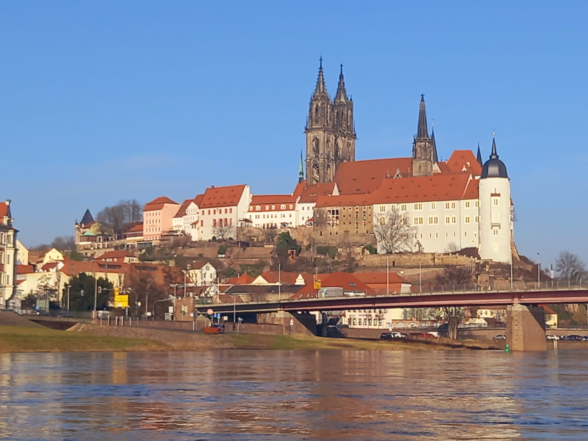

# Ende Februar die erste Wanderfahrt in 2026

Der sehr kalte Winter 2026 hörte genau eine Woche vor der Wanderfahrt auf, so dass wir bei Frühlingstemperaturen mit drei Booten in Meißen starten konnten.
Am Samstag ging es bei 18 Grad und windstille die 75 km die Elbe abwärts bis nach Torgau.
Hier hatte der Landdienst Martin das traditionelle Grünkohlessen vorbereitet.

Der Sonntag brachte dann zwar nur 12 Grad und viel Sonne, aber für den 2. März eine sehr ordentliche Temperatur. Im Unterlauf dann leider etwas Gegenwind, so dass die 82 km doch etwas anstrengender war. Dazu kam noch, dass die Marathon-Ruderer heute im Extraboot "Training" ruderten und nicht mehr im gemischten Boot wie am Vortag.

