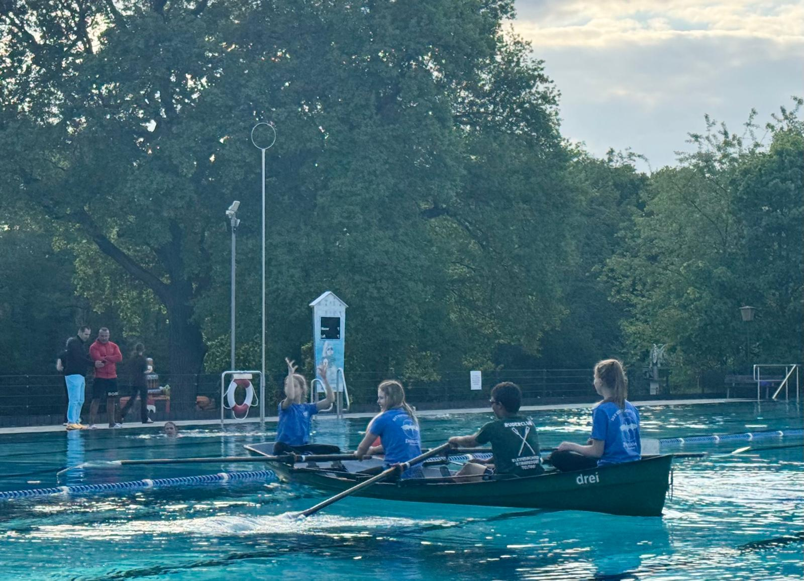

Die Feier zum 50jährigem Jubiläum des Freibades Kiebitzberge war eine Möglichkeit den Ruderclub zu präsentieren.
Wir hatten exklusiv vier Bahnen im Schwimmerbecken bekommen, um probe rudern anzubieten.
Der erste Test ergab, dass man unsere Ruderjolle mit 5 Schlägen über die 50m Distanz bekommen konnte. Dann war aber eine massive Notbremsung nötig, um nicht am Ende anzuschlagen.
Die zahlreichen Testruderer brauchten erheblich mehr Ruderschläge, aber hatten viel Spaß bei den Versuchen.

