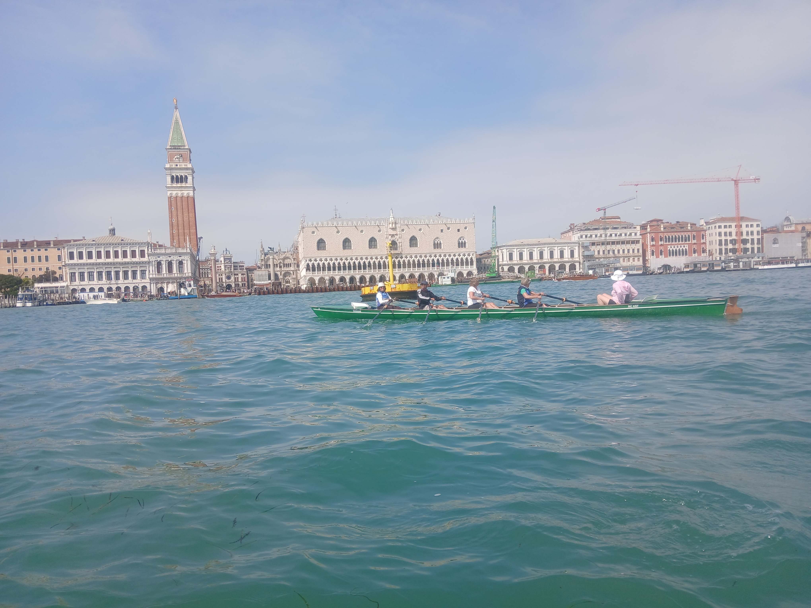

# Osterwanderfahrt durch Italien

## Über den Ticino, den Po, die Lagune von Venedig, die Sile bis zur Adria

Da Ostern dieses Jahr bereits recht früh lag, entschieden wir uns für eine Wanderfahrt im hoffentlich sonnigen Süden. 
Das stimmte schon mal Tagestemperaturen zwischen 18 und 24 Grad und zwei Wochen lang nicht ein Tropfen Regen.

Der Anhängertransport reiste mit einem Zwischenstop beim Ulmer Ruderclub nach Pavia an. Die restliche Teilnehmer trudelten im Laufe des Samstag Abend mit Zug und Flugzeug in unserer einfachen Pension in Pavia ein.
Die Pizzeria in fußläufiger Entfernungen kannten wir noch vom letzten Mal. Preiswert, gut und ausreichende Portionen.

Am nächsten Morgen setzten wir am Steg des Universitätsrudervereins die Boote in den Ticino. 
Sandbänke und Treibgut, welches sich an Untiefen und den Brückenpfeilern festgesetzt hatte, erforderte volle Konzentration der Steuerleute. Gerade in der Stadtdurchfahrt durch Pavia sollte man nicht träumen.
Danach wurde das navigieren etwas leichter, aber der Wasserstand war ungewöhnlich niedrig. Die Steuerleute waren gefordert.
Nach 10 km mündete der Ticino in den Po, der führte allerdings auch nicht viel Wasser und die Strömung liess nach.
Die Ufer waren recht hoch, aber am Horizont waren immer wieder Berge zu bewundern, so dass die Strecke interessant aber sehr einsam war. Ab und zu einzelne Häuser, kaum Ortschaftenn und außer vereinzelte Anglern kein Mensch auf dem Fluß oder am Ufer.
Die erste richtige Ortschaft war nach 71 Ruderkilometern, unser Ziel Piacenza. Wir konnten unsere Boote am Steg des örtlichen vertäuen. Die Entfernung zu unserem Hotel war in Luftlinie nicht sehr weit, aber durch Hafen- und Bahnanlagen versperrt, so dass uns der Landdienst zum Hotel shutteln musste.
Das Hotel Astor lag zentral in der Stadt. Die Zimmer recht eng, aber für Ruderer ausreichend.
Zum Abendessen gönnten wir uns ein Indisches All-you-can-eat Büffet Restaurant in der Nähe. Etwas über unserem üblichen Etat, aber alle wurden satt.

Der zweite Rudertag führte wieder durch absolute Einsamkeit nach Cremona. Nach über der Hälfte hatten selbst WaWa und Stefan Neuwasser. Beim letzten Mal war die neugebaute Schleuse (die einzige auf dem Po) noch im Bau. Diesmal ging es durch die Schleuse, nachdem wir den Schleusenwart aufgeweckt hatten. Schön, dass an der Schleuse Telefonnummern stehen, die man anrufen soll. Schade nur, dass niemand ran geht.
Nachdem wir rund 15m nach unten geschleust waren, ging es den erstaunlicherweise strömenden Schleusenkanal abwärts. Nach einige Kilometern erreichten wir wieder den Fluss. Mit dem Neubau der Schleuse hatte sich wohl die Kilometrierung des Po verschoben, so dass wir erst nach 41 Kilometern Cremona erreichten.
Unser Quartier (Vita Residence) war in einem Vorort auf dem Steuerbordufer, so dass wir von Cremona nicht viel zu sehen bekamen. Die Appartements waren gut ausgestattet, so dass wir selbst kochen konnten. Die Umgebung ist allerdings etwas runter gekommen, ein Supermarkt oder eine Eisdiel waren zumindest zu Fuß nicht erreichbar, Fußgänger sind hier wohl nicht vorgesehen.

