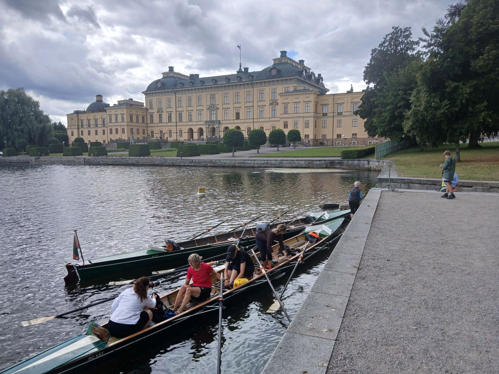

Dieses Jahr gab es außer der Schärenwanderfahrt noch eine weitere Fahrt auf der Süßwasserseite von Stockholm, auf den Mälaren.

Während die erste Fahrt auf dem Salzwasser eine Bewegungsfahrt war, hatten wir dieses Mal ein Luxus- Standquartier auf der Insel Färingsö.

Freitag Abend ging es auf die Fähre von Rostock nach Trelleborg.
Am nächsten Morgen fuhren wir mit drei Autos quer durch Schweden, vorbei an Stockholm zum Mälaren. 
Dieser See erstreckt sich von der Stockholmer Innenstadt 120 km landeinwärts und ist mit 1090 km² und 1.200 Inseln der drittgrößte See in Schweden. (doppelt so groß wie der Bodensee)

Unser Ferienhaus lag etwa 25 km von Stockholm entfernt auf der Insel Färingsö. Ein großes Hauptgebäude und etliche Nebengebäude mit 24 Betten. Dazu eine Industrieküche und ein großer Speisesaal.

Am Nachmittag trudelten die langsam alle Ruderer ein und wir luden am örtlichen Badestrand die Boote ab. Die Zufahrt war etwas eng, aber wir hatten erfahrene Anhängerfahrer.
Dazu besuchten uns noch Felix und Sinah, die auf Rückweg von ihrem Norwegen Urlaub bei uns Station machten.

Der erste Rudertag begrüßte uns mit strahlendem Sonnenschein, 23 Grad und leider auch 4 Beaufort Wind. Wir umrundeten die Insel Färingsö nördlich. Leider erwies sich eine Durchfahrt in der Wassersportkarte als vollkommen unfahrbar, so dass wir einen Umweg ruderten mussten. Schließlich erreichten wir Schloss Svartsö, das an einem schmalen Kanal, windgeschützt lag. Hier gab es nicht nur ein Cafe, sondern heute auch eine Ausstellung historischer Autos.
Danach ging es zu einem Badestrand auf der Ostseite von von Färingsö, wo wir die Boote über Nacht ablegten. Da unser Quartier über Land nur 3 km entfernt lag, marschierte die Mannschaft zurück zum Haus.

Am Morgen fuhren wir mit den Autos zurück zu unseren Booten und machten uns daran Färingsö südlich zu umrunden. Das Zwischenziel war Schloss Drottningsholm, der Wohnsitz des Schwedischen Königshauses. Wir legten fast direkt vor dem Schloss an und machten eine größere Pause. Den König haben wir nicht getroffen, aber Schloss, Park und die marschierenden Wachen waren sehenswert.

Der Rückweg lief leider nicht so wie gewünscht. Der Wind hatte deutlich zugenommen und wehte direkt von vorne. Anstrengend aber noch gut ruderbar. Leider gab es hinter der Brücke von Ekerö einen langen schlauchförmigen See. Hier staute sich der Wind derartig, dass die Wellen über einen Meter Höhe erreichten. Wir kämpften uns drei Kilometer vorwärts, um dann endlich in einen Nebenarm unter Windschutz abzubiegen. 

Nach den Strapazen des Vortags machte die Jugend einen touristischen Ausflug nach Stockholm (Vasa-, Vrag-Museum, Altstadt).
Die Vierer der Erwachsenen ruderten einen Kurztrip nach Norden, Ziel Kungsängen. Eigentlich mit Windschutz gegen den heftigen Westwind. Leider war der auf dem Rückweg so heftig, dass die Boote auch wieder zu kämpfen hatten.

Der nächste Rudertag entschädigte uns für die Strapazen. Bei Sonne und fast keinem Wind sollten die Boote wieder zurück zum Quartier gerudert werden, allerdings mit einem kleinen Abstecher in die nördliche Inselwelt, bis zur Insel Västra Högholmen. Traumhafte Insel, ruhiges Wasser und traumhafte Sandstrände, fast Karibik- Feeling.
Nach einer längeren Pause ging es zurück zum Quartier.

Da wieder wenig Wind und Sonne angesagt war, wagten wir uns auf die lange Südstrecke zur Insel Björkö. Hier liegt das alte Wikingerhandelszentrum mit Museum, wiederaufgebauten Wikingerhäusern und einem Christlichen Kreuz auf dem höchsten Berg der Insel. Normale Touristen kommen mit dem Ausflugsboot, wir lagerten unsere Ruderboote am Strand.
Die Insel ist auf jeden Fall sehenswert, wir gönnten uns zwei Stunden Touristenprogramm.
Danach ging es wieder zurück, alles zusammen 42 Ruderkilometer.

Am letzten Rudertag hatte die Temperatur noch mehr zugenommen, bis 28 Grad. Wir ruderten zum Strandbad Ekerö. Einige Ruderer waren etwas nervös, da wir dafür die Strecke passieren mussten, die uns vor einigen Tagen mit hohe Wellen gefordert hatte. Dieses Mal war alles friedlich und wir genossen die Badepause am Sandstrand.
Das Jugendboot legte sogar auf dem Rückweg noch einmal an einem Strand an und sprang ins Wasser.

Abends wurde die Boote aufgeladen und am nächsten Tag ging es wieder südwärts nach Trelleborg. 
