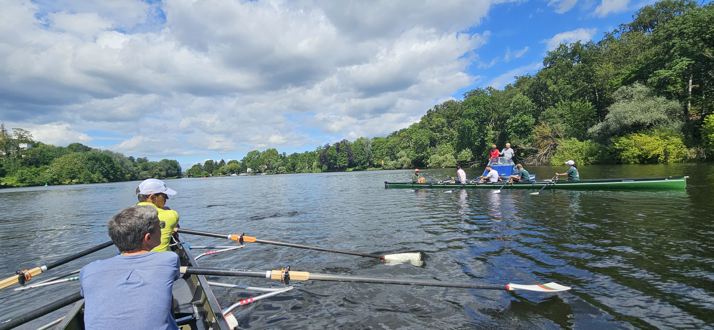

Am Wochenende vom 06.–07. Juni 2026 konnten wir im zweiten Jahr ein Trainingswochenende mit Patrick und Eberhard anbieten. Beide sind voll ausgebildete Rudertrainer (B-Trainer), und nach der erfolgreichen Erstauflage im Jahr 2025 hatten wir entschieden, die Veranstaltung zur Rudertechnik und Rudertheorie erneut für Ruderwarte, Marathonruderer und weitere Interessierte anzubieten.

Los ging es am Samstagmorgen mit zwei C‑Vierer-Booten zu einem ersten Stelldichein auf dem Teltowkanal und dem Griebnitzsee. Verschiedenste Übungen wurden absolviert, und parallel dazu fertigten die beiden Trainer Videoaufnahmen an. 

Mittags waren wir zurück am Ruderclub, wo der Theorieteil begann und die ersten Erfahrungen gemeinsam besprochen wurden. Eindrücklich wurde am Ergo der Ruderablauf simuliert, wobei die Teilnehmer die einzelnen Bewegungen und Abfolgen benennen und erläutern sollten. Diese Interaktion half sehr dabei, den Ruderablauf bewusster wahrzunehmen und besser zu verstehen.

Im weiteren Verlauf stand die Auswertung der aufgenommenen Rudervideos im Mittelpunkt. In der Gruppe wurden die Sequenzen gemeinsam angeschaut, systematisch kommentiert und intensiv diskutiert. Dabei konnten sowohl individuelle Bewegungsabläufe als auch das Zusammenspiel im Boot analysiert werden. 

Die Trainer gaben gezielte Hinweise zu Technik, Timing und Haltung, während die Teilnehmer ihre eigenen Eindrücke einbrachten. Dieser offene Austausch ermöglichte es, Fehlerbilder zu erkennen, Unterschiede sichtbar zu machen und konkrete Verbesserungsansätze für die nächste Praxisphase mitzunehmen.

Unterbrochen von einem gemeinsamen Essen folgte am Nachmittag die zweite Praxisphase, die erneut voll von Übungen war und die besprochenen Hinweise direkt auf dem Wasser umsetzte. Insgesamt war es ein intensiver, langer und sehr austauschreicher Tag.

Am Sonntag folgten wir derselben Struktur und übertrugen viele Erkenntnisse aus dem Vortag in weitere Übungen auf dem Wasser, zum Beispiel Varianten des Ruderns mit stehendem Blatt über mehrere Kilometer. 
Alle waren sich einig, dass selbst diese kurzen Strecken durch die hohe Konzentration auf die Ruderabfolge durchaus anstrengend sein können.

Nach einer weiteren Besprechung in der Gruppe und einem abschließenden Feedback wurde der Kurs mit einem gemeinsamen Mittagessen beendet. Es war eine sehr schöne Erfahrung – sowohl für die Teilnehmer als auch für die Trainer – und wir hoffen auf eine Neuauflage des Kurses im Jahr 2027!

Ein herzliches Dankeschön möchten wir an dieser Stelle allen helfenden Händen aussprechen. Der Dank geht an Wolfgang für die Bereitstellung einer Übernachtungsmöglichkeit, an Martin für die Steuerhilfe sowie an den Berliner Ruderclub für das Ausleihen des Trainermotorbootes.

