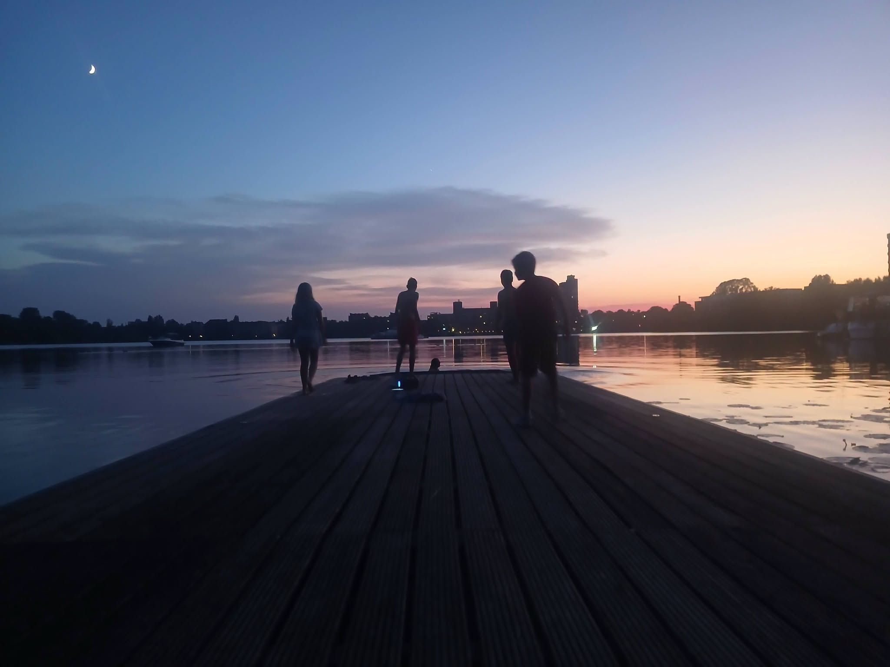

Ende April waren unsere Anfängerkurse recht erfolgreich, so dass wir für unsere Kinder und Jugendlichen eine erste Anfängerwanderfahrt anbieten wollten.
Daher ging zur Sonnenwende nach Spandau.
Freitag Nachmittag starteten wir bei 34 Grad und strahleden Sonnenschein, nach Spandau. Die Hitze war unerträglich und die 25km zogen sich hin.
Kurz nach 20 Uhr passierten wir die Bootsschleppe Spandau und erreichten den Ruderverein Brandenburgia. 
Carlos war der erste Obmann der ankam und ging schnell noch bei Lidl einkaufen.

Nach dem Abendessen wurde noch ein nächtlichs Bad genommen. Gegen 23 Uhr hatten wir noch 23 Grad....

Samstag drehten wir eine Oberhavel Runde und dann zum Tegler See und auf das Tegler Fliess. Allerdings nur bis 10m vor der Mühle, da lag ein Baum quer.
Wenden auf dem Fliess ist für einen Vierer ziemlich knapp.

Vom Steg des Tegler Ruderclubs spazierten wir nach Alt-Tegel zur Eisdiele.

Die Temperaturen waren wieder über 30 Grad, aber heute bei teilweise bedeckten Himmel. 

Den Rückweg beschleunigten wir etwas, da für 15 Uhr eine Gewitterwarnung vorlag. Die stimmte dann zwar nicht, aber dafür waren wir früh zurück, so dass ausgiebig gebadet werden konnte.
Spätabends wurde noch Fußball geguckt, so dass die Kinder erst sehr spät ins Bett kamen.

Sonntag ging es zunächst über die Bootsschleppe und dann durch Klein-Venedig. Leider hatte der Wetterbericht das aufziehede Gewitter irgendwie vergessen. Das erste Boot erreichte das Bootshaus vom RV Berlin am Stößensee gerade noch 10 Minuten vor dem Wolkenbruch. Das nächste Boot hatte nicht sovie Glück und kam gut geduscht 20 Minuten später an.
Noch einmal Dank an die Leute vom RV Berlin, dass wir uns unterstellen und trocken legen konnten.

Der Rest des Rückwegs war dann trocken.

Wir hoffen, dass alle unsere Anfänger das Wochenende gut überstanden haben und sie sich demnächst auch auf größere Fahrten trauen.

