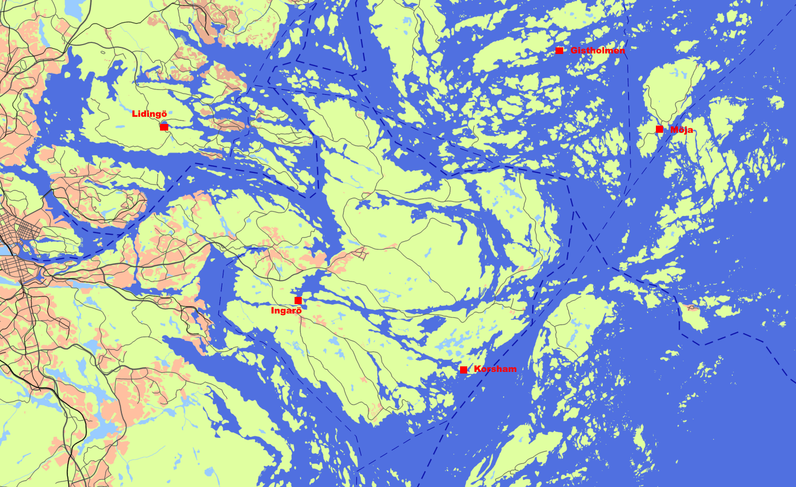

Am Zeugnistag ging es mit zwei Inriggern auf dem Anhänger über die Fähre Rostock-Trelleborg nach Schweden.
Von hier 650km nach Norden zum Ruderverein Lidingö. Boote abladen und riggern dauerte etwas, aber noch viel länger dauerte das Aufbauen der Zelte. Drei unser jugendlichen Teilnehmer hatten das augenscheinlich noch nie gemacht....

Der erste Rudertag führte uns in die Stockholmer Innenstadt. Zunächst nach Djurgarden. Hier wurden die Boote an einem Steg festgemacht und das Vasa Museum besichtigt.
Danach wurde Lars, der mit dem Nachtzug angereist war, direkt vor dem Parlamentsgebäude eingeladen. 

Vom Boot aus konnten wir diverese Sehenswürdigkeiten bewundern. Sogar die Wachablösung marschierte am Ufer vorbei. Der Verkehr mit Fähren und Touristenbooten war dicht, mit entsprechenden Wellenschlag. Da wir in Inriggern saßen störte uns das nicht sehr.

Zurück nach Lidingö erwischte uns leider ein heftiger Platzregen (Wetterbericht hatte eine Stunde leichten Nieselregen versprochen). Bei der Stockholmer Rudergesellschaft konnten wir uns danach trocken legen. 
Den Rest des Rückwegs schien wieder die Sonne. 

