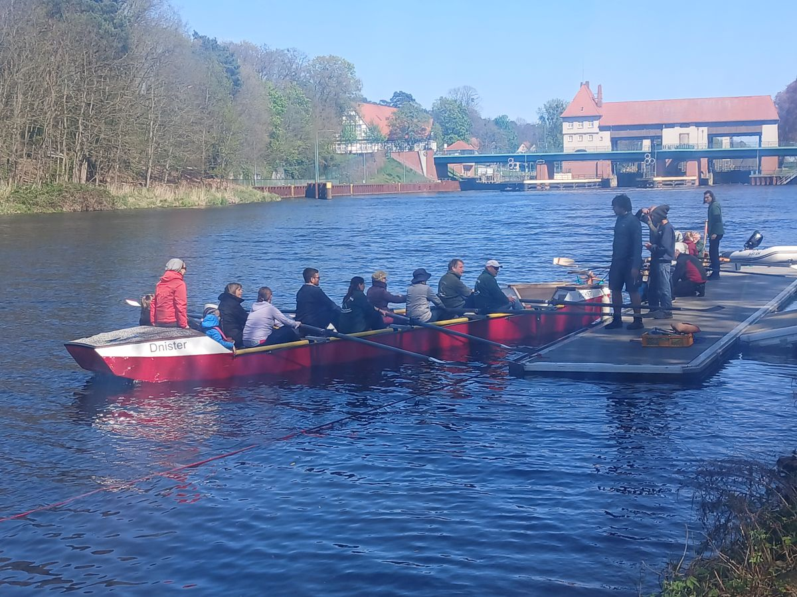
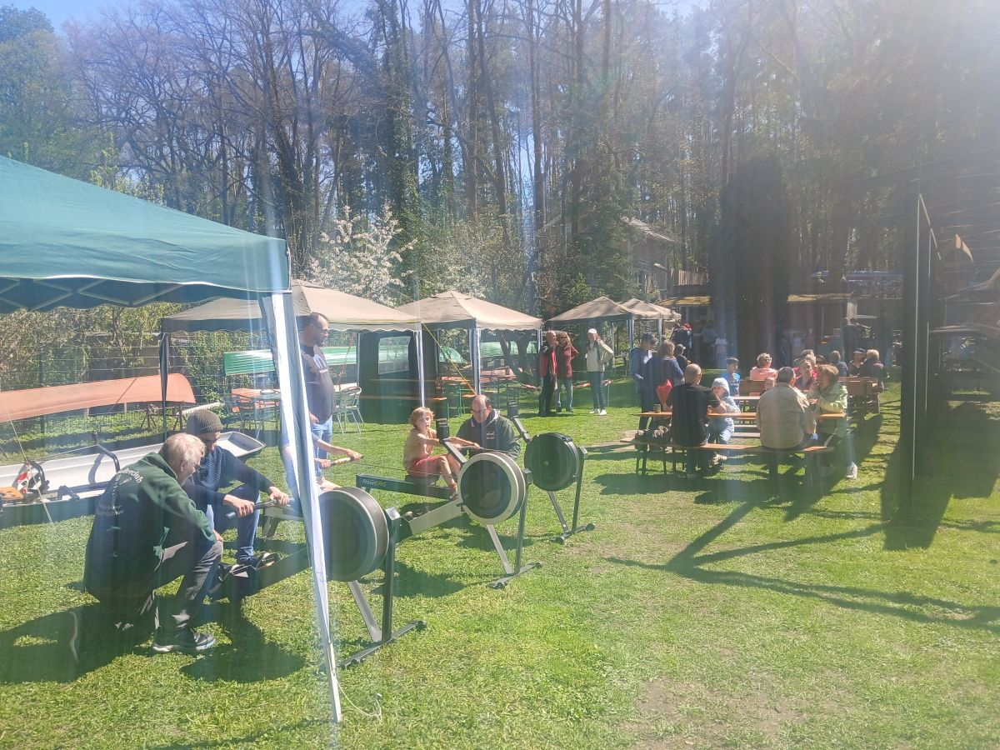
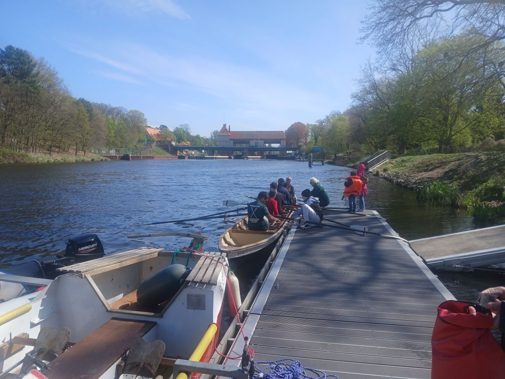
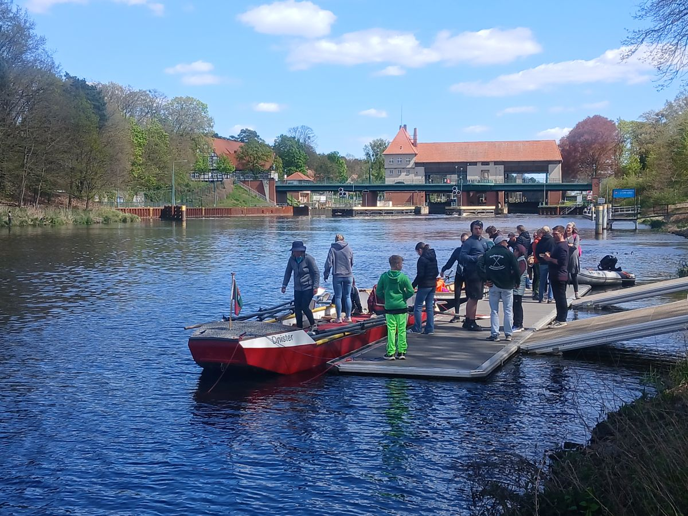

Ende April fanden unsere Tage der offenen Tür statt. Bei gutem Wetter waren wieder unzählige Besucher auf unserem Clubgelände am Teltowkanal.
Samstag und Sonntag waren pausenlos 4-5 Boote im Einsatz, um allen Gästen das Proberudern zu ermöglichen.
Unser Catering- Team war auch gut beschäftigt damit niemand hungrig oder durstig blieb.
Wir hoffen, dass es allen gefallen hat und wir zahlreiche neue Ruderer gewonnen haben.

Der anschließende Anfängerkurs mit 39 Teilnehmer war neuer Rekord. Nach 10 Ruderterminen traten viele der Neuen in den Ruderclub ein.

