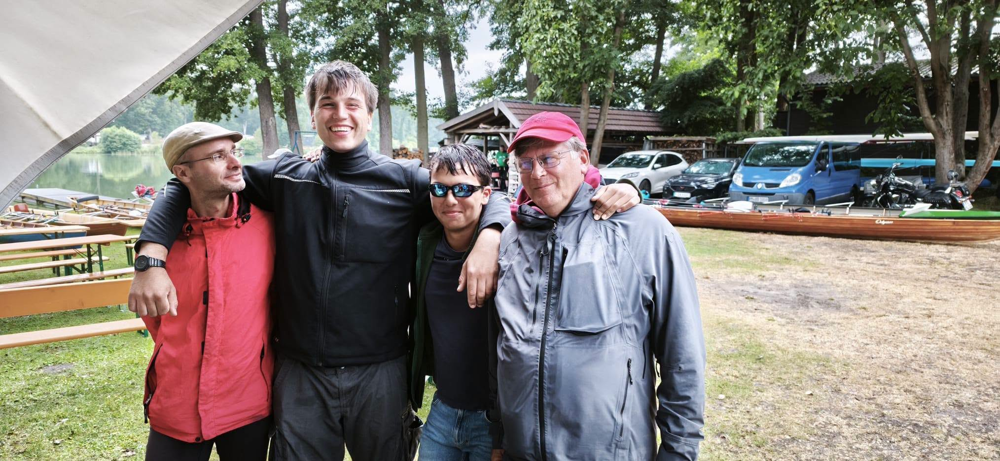

Das Wanderrudertreffen des Landes Brandenburg fand dieses Jahr beim Ruderverein Lehnin statt.
Gefeiert wurde auch 100 Jahre rudern in Lehnin.

Anreise mit dem Auto kann jeder, wir nahmen die Ruderboote.
Freitag 28 km nach Ketzin, eigentlich kein Problem. Mit Windstärke 6-8 aus West, nicht so erfreulich.
Wir kämpften uns über Griebnitzsee und Jungfernsee zum Sacrow-Paretzer-Kanal, über die Wublitz nach Ketzin. Vier Stunden bei der Windrichtung war immer noch ganz gut.

Am nächstn Morgen ging es weiter über den Trebbel See, anfangs nur 4 Windstärken von vorne nach Klein Kreutz. 
Hier trafen wir auf die restlichen Teilnehmer des Wanderrudertreffens, die aus Kirchmöser über den Plauer See gerudert kamen. Die hatten immerhin Rückenwind.
Leider fing es am Ende der Mittagspause auch noch an zu regnen. Zuerst nur leichter Niesel, zum Schluß ergiebiger Landregen.
Das wir nach Süden in den Emster Kanal abbogen, immerhin kein Gegenwind mehr.

In Lehnin fand eine gut organisierte große Party mit über 100 Ruderern statt. Glücklicherweise in einer leer geräumten Bootshalle, draußen war es alles andere als gemütlich 15 Grad und Regen stellt man sich nicht als Sommerwetter vor.

Sonntag gab es dann zwar trockenes Wetter, aber weiter stürmischen Wind bis 6 Beaufort. Da der Wind etwas gedreht hatte zunächst schräg von vorne, aber mit erreichen der Havel war es dann Schiebewind.
Wir flogen geradezu nach Hause, bei 60km Strecke waren wir für diese Hilfe dankbar.
Trotzdem nicht gerade ein gemütliches Sommerwetter.

