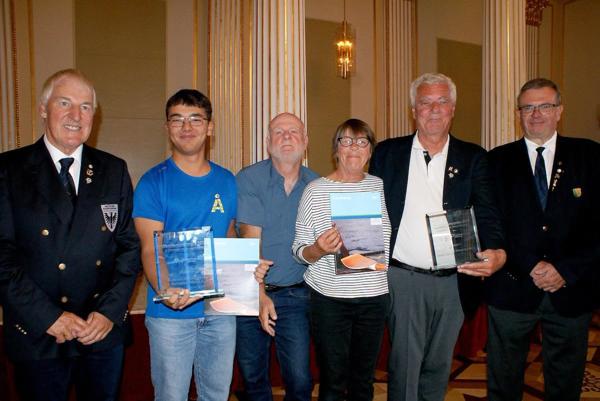

# Winsauer Preis geht wieder an den RC KST

## RC KST Deutschlands erfolgreichster Wanderruderverein (mittelgroße Vereine)

Das Deutsche Wanderrudertreffen fand dieses Jahr in Schwerin statt.
Im Rahmen des Wanderrudertreffens wird jedes Jahr der Winsauerpreis für die erfolgreichsten Wanderrudervereine Deutschlands verliehen.
Auch für das Jahr 2025 ging dieser Preis, in der Gruppe mittelgroße Vereine, an den RC KST.

Gewertet werden hier die Wanderruderkilometer des Vereins und die Zahl der Teilnehmer des Vereins am Wanderruderwettbewerb des Deutschen Ruderverbands. Das ganze im Verhältnis zur Zahl der aktiven Mitglieder.

Der RC KST hat diesen Preis offiziell zum 15. Mal gewonnen (17. Mal wenn man die beiden Corona Jahre mitrechnet)

Da die Schweriner RG etwas knapp am Bootsplätzen war, haben wir unsere Barke mitgebracht.
Das Einsetzen an der Slip-Rampe ging nur mit einigen Schwierigkeiten, da die Rampe einen zu steilen Knick hatte. Aber mit etwas basteln klappte es dann doch.

Samstag ging es mit rund 220 Ruderern auf einer Runde um den Schweriner See. Wegen des Windes auf einer etwas veränderten Strecke.
Der Abend im Festzelt litt etwas unter Knappheit am Büffet, aber zum Schluss wurde jeder satt.

Am Sonntag erhielten wir unseren Winsauerpreis im festlichen Rahmen des Neustädtischen Palais.

Damit wir auch 2026 wieder erfolgreichster Deutscher Wanderruderverein werden, ist hier der Aufruf an Wanderfahrten teilzunehmen und insbesondere wäre es schön, wenn möglichste viele Ruderer ihren Jahreswettbewerb schaffen.
Je nach Alter braucht man dazu 200-800 km. Davon müssen 100-160 km auf Wanderfahrt oder auf Tagesfahrten über 30 km erbracht werden.

