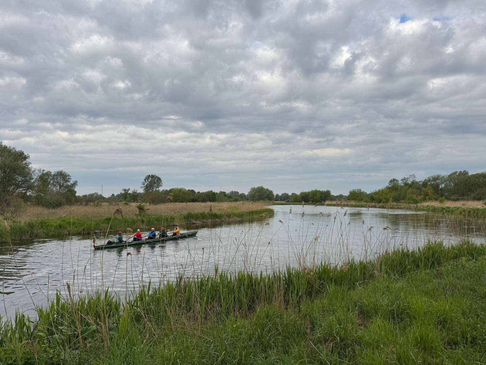
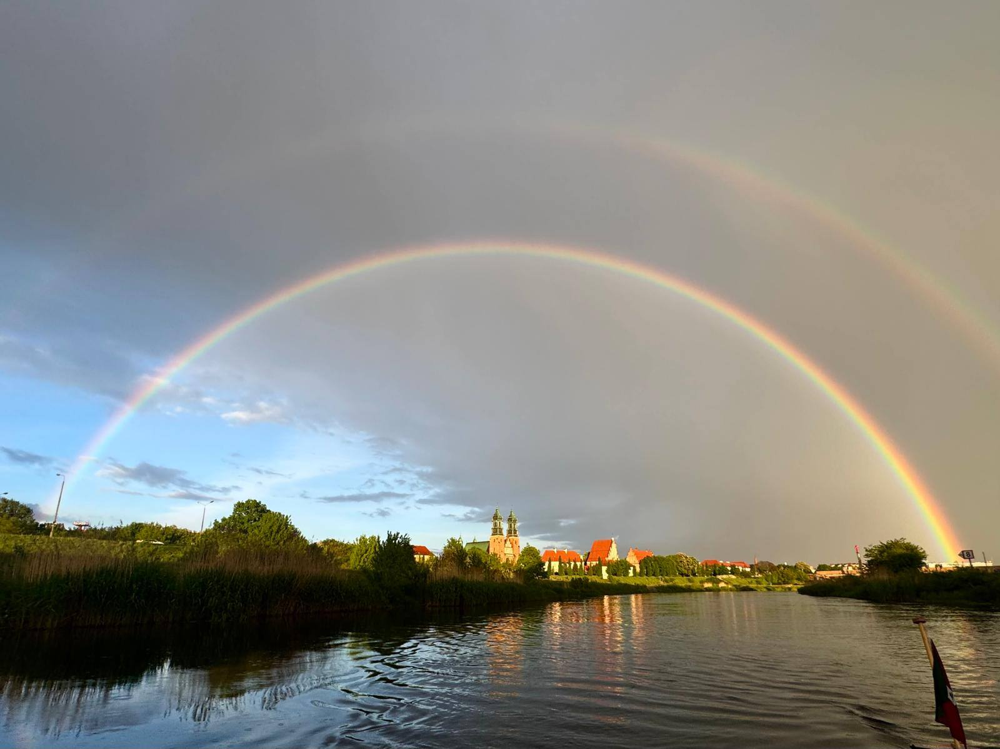
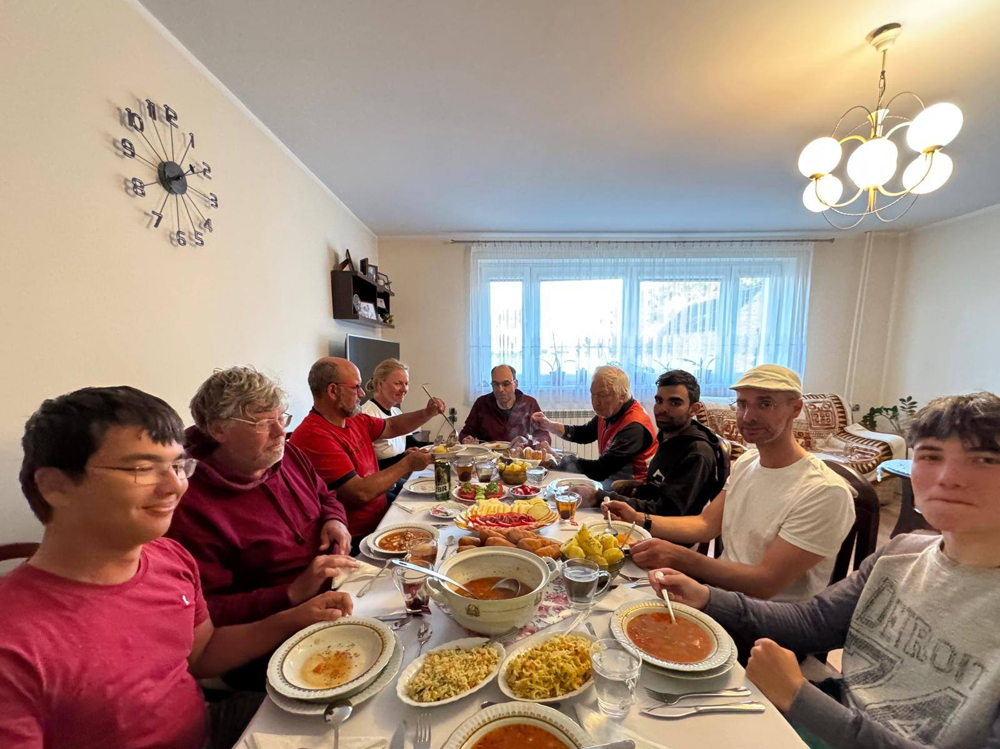

Die Warthe (polnisch Warta) hat eine Länge von 808 Kilometern. Sie entspringt im Krakauer Jura und mündet bei Küstrin in die Oder. 
Die viertägige Marathonfahrt auf der Warthe wird seit etwa 10 Jahren regelmäßig ins Frühjahrsprogramm aufgenommen und ist ein Ausdauer-Ruder-Ereignis für hartgesottene Ruderer mit 392 km Länge.

Es hatten sich zehn Ruderer angemeldet. Teilnehmer: Stefan B., Martin, Thomas, Wolfgang, Carlos, Rufus und Timo. Gäste Katharina, Stefan S. und LarsDer Wetterbericht sagte starke Gegenwinde voraus, so dass Stefan anstelle der sonst bevorzugten Zweier + auf einen Vierer+ und einen Dreier+ zurückgriff.

Am Mittwoch den 13. 05. um 15 Uhr ging es los Richtung Kolo. Der Verkehr auf der Autobahn 12 nach Frankfurt war ein einziger Stau. 
Stefan war mit der Bahn nach Kolo vorausgefahren und Martin steuerte unseren Bus mit dem Bootsanhänger sicher durch den Verkehr. Kurz vor 20 Uhr kamen wir vor unserem netten Hotel in Kolo an und dank der Telefonkommunikation hatte Stefan unsere Essensbestellungen bereits an die Hotelküche gemeldet. 

Am Donnerstagmorgen setzten wir unsere Boote an der bekannten Einsatzstelle ein. Die Warthe hat vom Gefälle her (22 Meter auf 100km) nur eine geringe Strömung. Der Gegenwind in dem offenen Wiesengelände schob das Oberflächenwasser bergauf, so dass es sich so anfühlte, als ob gar keine Strömung vorhanden sei.  Stefan übernahm den Dreier mit drei Jugendlichen und die Erwachsenen ruderten im Vierer. 
Diese Einteilung wurde für die gesamte Fahrt beibehalten. Kolo liegt in der Woiwodschaft Großpolen und war im 14. Jahrhundert vom polnischen König Kasimir gegen den Deutschen Kreuzritterorden befestigt worden. Vom Boot aus sahen wir die Ruinen der mächtige Backsteinfestung an einer Flussschleife liegen. 

Die Warthe ist ein weitgehend unregulierter Fluss. Wild wird der Fluss nur durch schiebendes Hochwasser, dass die weiten Flussbögen überschwemmt und die Prallseiten einreißt.  Ein weiter Himmel spannte sich über einer flachen Landschaft mit vereinzelten Baumgruppen und hier und dort einmal ein weit entfernter Kirchturm einer Ortschaft.

Die Luft war kühl und wir waren froh, als der Wind zum Nachmittag nachließ. Am frühen Abend hatten wird die 92 km bis Pyzdry geschafft. Beim örtlichen Yachthafen nahmen wir die Boote heraus und fuhren zu unserem üblichen Quartier beim Obstbauern, wo wir hervorragend bewirtet wurden. 

Freitagmorgen wachten wir auf bei grauem Himmel und dem Geprassel von Regen auf das Wellblechdach der Scheunentreppe. Unsere liebenswürdigen Gastgeber trugen mehrere Tablett-Ladungen mit Brot, Eieren, Wurst, Käse, Aufschnitt heran und wir genossen ein schönes Frühstück, während wir alle einem Regentag nicht gerne entgegensahen.

Der Wind hatte nachgelassen und der Regen fiel nicht so heftig, wie das Trommeln auf dem Wellblechdach es vermuten ließ. Diese Etappe sollte uns bis hinter Posen führen und 116 Flusskilometer lang sein. Mit Regenjacke und Regenhose ging es los. Der Tag brachte trockene Phasen und manchmal sogar wärmende Sonnenstrahlen, aber zum Nachmittag kamen wir wieder in eine Regenzone.  

Die Warthe machte keine scharfen Kurven. Es gab keine Anzeichen für Mäander-Durchbrüche. Das liegt wohl an der geringen Strömung und die kurzen Hochwasserschübe reichen wohl nicht aus, um den Flusslauf zu verlegen. Die Uferlandschaft lag abschnittsweise etwas höher und infolgedessen konnten sich Wälder bilden. Die Ufer waren gekennzeichnet von Biberspuren und Rutschen. Wir passierten eine Anzahl von Seilfähren, die aber alle bis auf einzige Ausnahme an einem Hochseil hingen. Da wir kein Schallsignal geben, erfordert eine Fährstelle immer erhöhte Aufmerksamkeit des Steuermannes.

Ein wunderbarer Regenbogen belohnte uns bei der Durchfahrt durch Posen. Unser Landdienst stand winkend am Ufer und wies uns auf unseren Anlandeplatz hin, der aus einem 1 Meter hohen Gestrüpp aus Brennnesseln, Schilf und jungen Bäumchen bestand, in das wir die Boote mit vereinter Anstrengung hineinzogen und schoben. 

Wir waren gut in vier Wohncontainern untergebracht, die nur wenige Meter von unsren Booten entfernt auf einer Anhöhe über dem Fluss lagen. An diesen Abend kochten wir selbst ein Mahl aus Piroggen, den polnischen Teigtaschen, die auch angebrannt gut schmecken. Nach dem anstrengenden Rudertag fielen wir alle wie die Steine ins Bett.

Am Samstagmorgen gelang es uns, ohne Schwierigkeiten unsere Boote im Gebüsch wiederzufinden und zu Wasser zu bringen. Wie an den anderen Tagen auch wurde über Bug ein- und ausgestiegen. 

Wir hatten eine Etappe von 106 km bis zur kleinen Ortschaft Stary Zatom vor uns. 
Ein leuchtend blauer Himmel wölbte sich von Horizon zu Horizont bei mäßigem Wind. Auf diesem Flussabschnitt trafen wir auf einige am Ufer liegende Motorboote, Kanuwanderplätze und völlig verwaiste Marinas, die Zeugnis davon ablegten, dass man die Touristikindustrie aufbauen möchte. Weit hinter uns im Osten türmten sich mächtige Quellwolken-Gebirge auf, die von einer östlichen Windströmung in größerer Höhe mitgenommen wurden und über uns daher trieben und es kälter werden ließen. Am Ufer hockten Angler in regelmäßigen Abständen und winkten uns manchmal zu.

Anscheinend waren die Uferwiesen hier weniger sumpfig, so dass Rinderhaltung praktiziert wurde. Malerische Bilder von tiefenentspannten gutaussehenden Kühen und Jungstieren boten sich uns dar. Am großen Himmel glitt einmal ein Adlerpaar mit der Thermik in die Höhe. Schwäne liefen flügelklatschend über das Wasser, um vor unseren Booten auszuweichen. Das Piepen und Rollieren der Rohrsänger schallte aus dem Schilfgürtel. Die Regel, den Bogen in der Außenkurve auszufahren, galt hier nicht, da Erdabbrüche wie buhnenartigen Sperrungen für das Wasser fungierten und Neerströmungen Sandbänke anhäuften. Die Landschaft wurde abwechslungsreicher mit Blicken über Felder, Wälder und Hügel.     Es war landschaftlich der schönste Abschnitt.

Am Abend legten wir die Boote auf einer nassen Wiese direkt hinter der Fähre von Stary Zatom. Übernachtungsplatz war ein Bauernhof, wo wir im Wohnzimmer reichlich bewirtet wurden. Schade, dass die Sprachbarriere keinen weiteren Kontakt mit unseren Gastgebern zuließ.

Am Sonntag übernahm Stefan den Landdienst, um uns in Skwierzyna mit Eis zu erwarten.  
Die Strecke bis Gorzow betrug 80 km. Das Wetter war trocken und die Luft kühl. Die Warthe wurde breiter und langsamer. 

Eine Hügelkette mit blühenden wilden Pflaumenbäumen begleitet uns im Norden nach der Einmündung der Netze. Ein Motorboot begegnete uns vor Gorzow. 

Stefan hatte den Bus mit dem Hänger in Gorzow abgestellt und war mit der Bahn direkt nach Berlin zurückgekehrt.  Wir landeten die Boote auf einer breiten Sandbank in Gorzow und verluden auf den Hänger. Zum Glück klappte es mit dem zweiten Schlüssel und Martin fuhr uns die 190 km sicher wie immer zurück Kleinmachnow, wo wir glücklich um 19:30 Uhr eintrafen. 

Eine herausfordernde Tour, die gut organisiert war und mit vielen Eindrücken einer weiten, unberührten Flusslandschaft und einer eingespielten Ruder-Kameradschaft im Gedächtnis bleiben wird.

