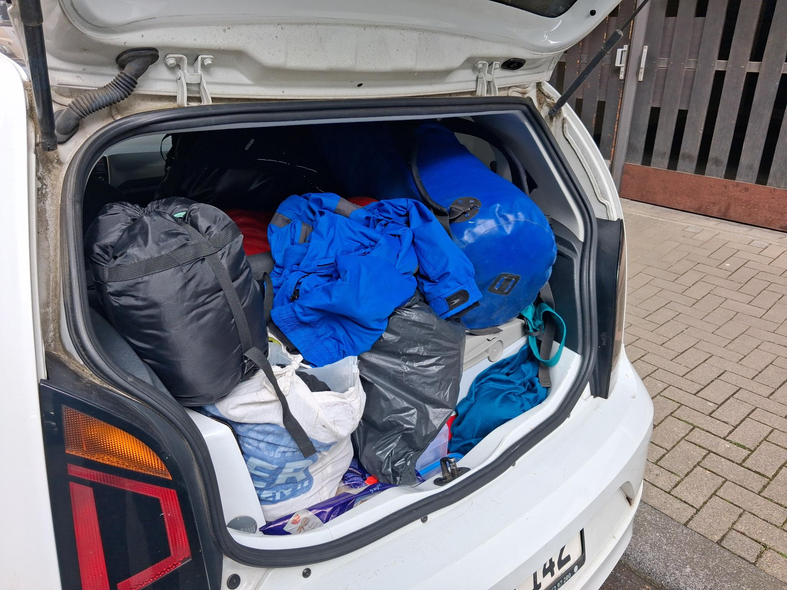

## Was ist Elfsteden?

Da uns die diesjährige Teilname bei [Hart van Holland](../hart-van-holland/index.md) und der [EUREGA](../Eurega/index.md) noch
nicht genug waren, wollten wir uns auch den diesjährigen Elfsteden Roeimarathon nicht entgehen lassen.
Dieser 210 Kilometer lange Marathon ist der längste, der zu diesem Zeitpunkt in den Niederlanden veranstaltet wird und umfasst
eine vielfältige Strecke durch verschiedene Städte um Leeuwarden herum.
Von offenen Seen zu vollen Grachten innerhalb enger Städte sowie Kanäle in freier Natur ist alles dabei.
Üblicherweise werden die C-Zweier, die in diesem Format genutzt werden, von Staffeln as 12 Personen gerudert,
die sich in regelmäßigen Abständen nach eigenem Ermessen abwechseln können.
Wem das zu viel Aufwand ist, oder falls man einfach nur etwas verrückt ist, ist es auch möglich, diese Strecke auch als sogenannte 'Bullen'-Mannschaft zu anzutreten.
Also nur in einer einzigen Mannschaft ohne Tausch zu fahren.

## Die Vorbereitungen

Nachdem Tim diese Veranstaltung bereits im letzten Jahr ([2025](../../2025/11-Steden-Roeimarathon 2025/index.md)) bestritten hatte und äußerst erfolgreich war, wollten wir dieses Jahr noch einmal daran teilnehmen.
Wir fanden einen dritten Mitstreiter - Michi, der and dieser Veranstaltung schon einige Male teilgenommen hatte.
Darunter sowohl zu dritt, als auch als Staffel in verschiedenen Größen.

Um den Anforderungen dieser Veranstaltung gerecht zu werden, liefen die Vorbereitungen schon weit im Voraus.
Ein Boot musste organisiert werden (Dank Michi die _Stromathlet_ vom Kölner Clubs für Wassersport (KCFW)),
passende Abdeckungen, elektrische System wie Bootsbeleuchtung, Fernstrahler, Geräteladung und Pumpe sowie zusätzliche Teile wie eine Stempelkarten-Halterung, Verpflegungsboxen, Abspannungen, Schwimmkörper etc..
Tim investierte viel Zeit und Geld in die Vorbereitung der Elektrik, sowie allem, was am Boot angeschraubt werden musste.
Michi übernahm einen Großteil der Logistik und alles was mit dem Bootsmaterial selbst zu tun hatte.
Einiges war natürlich nicht möglich, zu testen aufgrund des weiten Weges nach Köln, weswegen vor Ort noch etwas improvisiert werden musste.

## Anreise und Vorbereitungen

Tim und ich reisten am Mittwoch vor der Veranstaltung abends nach Köln an und übernachteten anschließend bei Michi.
Am Donnerstag packten wir unser kleines Auto, mit dem wir nach Leeuwarden fahren wollten.

Wir schafften es auch tatsächlich, alles zu verstauen!

Wir fuhren gegen 12 Uhr los und kamen ca. 3-4 Stunden später an unserer Unterkunft, dem Campingplatz _Hiddema State_ an.
Neben uns waren bereits viele andere Teams vor Ort und hatten sich bereits häuslich eingerichtet, viele große Pavillions, Zelte, Busse und Camper.

Nachdem wir unsere Zelte aufgebaut hatten, begannen wir, unser Boot, das von den Bonnern für uns mitgenommen wurde, abzuladen und aufzubauen.
Nachdem wir eine kleine Testrunde gedreht hatten, gab es nur noch etwas zu essen und von da aus ins Zelt.

Am Freitag morgen wurden wir durch eine leichte bis mittelstarke Mischung aus Regen und Hagel geweckt.
Nach einem kleinen Frühstück bereiteten wir unsere Verpflegung für das Boot vor.
Ein weiterer Punkt war die Überführung des Bootes zur _Roeivereniging Wetterwille_.
Dort fand die Abnahme des Bootes statt.
Unser Auto wurde freundlicherweise parallel zur Roeivereniging gefahren, sodass wir nach der Abnahme noch einmal zum Campingplatz zurück konnten.
Dort aßen wir Mittag und ruhten ein letztes Mal vor dem Start für ca. 20 Minuten.
Danach fuhren wir wieder zum Ruderverein, wo wir unser Boot zu Wasser ließen und zum Start fuhren.

## Start und das Rennen

Der Start lag weiter 5km vom Ruderverein entfernt.
Dorthin fuhren wir gemütlich, zum Glück regnete es auf dem nur kurz und nicht allzu stark.
Gestartet wurde anhand der Startnummer, was für uns (Nr. 25) bedeutete, dass wir verhältnismäßig wenige Boote vor uns hatten.
Gerade auf der ersten Strecke Richtung Borkum kam uns das sehr zugute, da an der ersten Stempelstelle dadurch noch wenig los war. 
Auf dieser Strecke fuhren wir hin und auch zurück, was hieß, dass alle Boote hinter uns uns auf dem Rückweg entgegen kamen.
Der Abend lief soweit ruhig ab, das Feld zog sich etwas auseinander, was das Rudern und Steuern deutlich angenehmer machte.
In der Nacht kamen wir auch gut mit unserem Tempo voran.
Leider war schon an den Tagen zuvor klar, dass die Temperaturen nicht besonders hoch steigen würden.
Nachts wurde es natürlich dementsprechend noch kälter. Bis zu 6 Grad wurde uns angezeigt, durchzogen von kurzen bis zu ca. 30 minuten anhaltenden Regenschauern teilweise auch inklusive Hagel.
Gerade mit dem Auskühlen während der Steuerpausen war das die Haupt-Schwierigkeit dieses Rennens.

Um ca. 3:30 Uhr fuhren wir in die blaue Stunde hinein, die Steuerpausen wurden weniger kalt und unser Flutscheinwerfer am Bug musste nur noch ab und zu eingeschaltet werden.
Mit der aufgehenden Sonne, bekamen wir die Information, dass nun doch aufgrund des starken Windes die vorher bekannt gegebene verkürzte Strecke gefahren wurde,  hieß, dass statt 210 km nur ca. 180 km gefahren wurden.
Während dem größten Teil der Strecke
Ungefähr 30 km vor dem Ende bekamen wir die Info, dass wir  der Stempelstellen

Zeiten der 3er-Bullen-Klasse:
- 7. Platz (1. iK): 18:09:34h (Startnr. 19)
- 14. Platz (2. iK): 18:33:02h (Startnr. 25)
- 17. Platz (3. iK): 18:41:54 (Startnr. 16)

