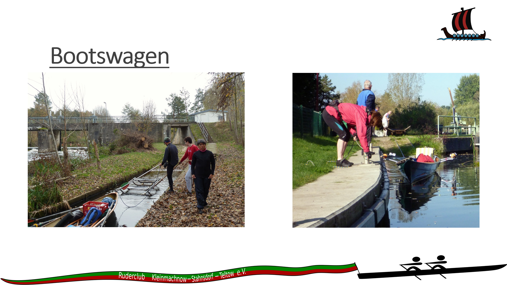
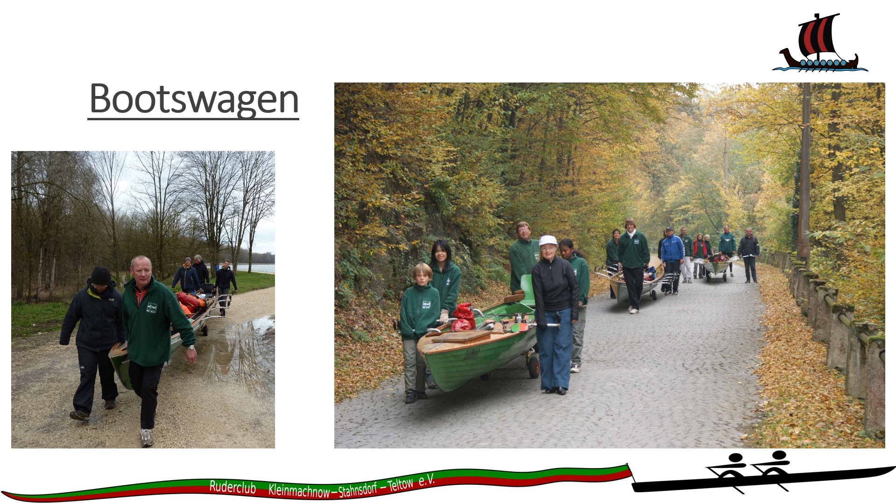
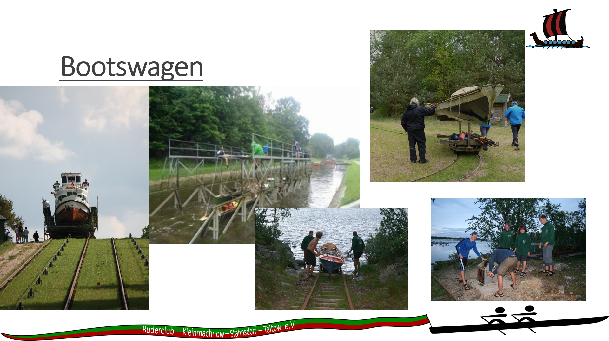
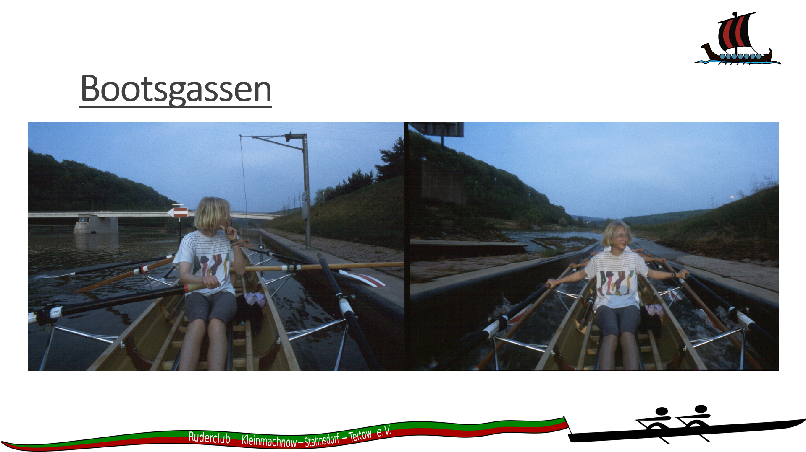
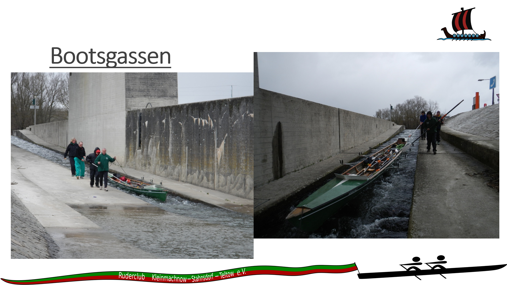
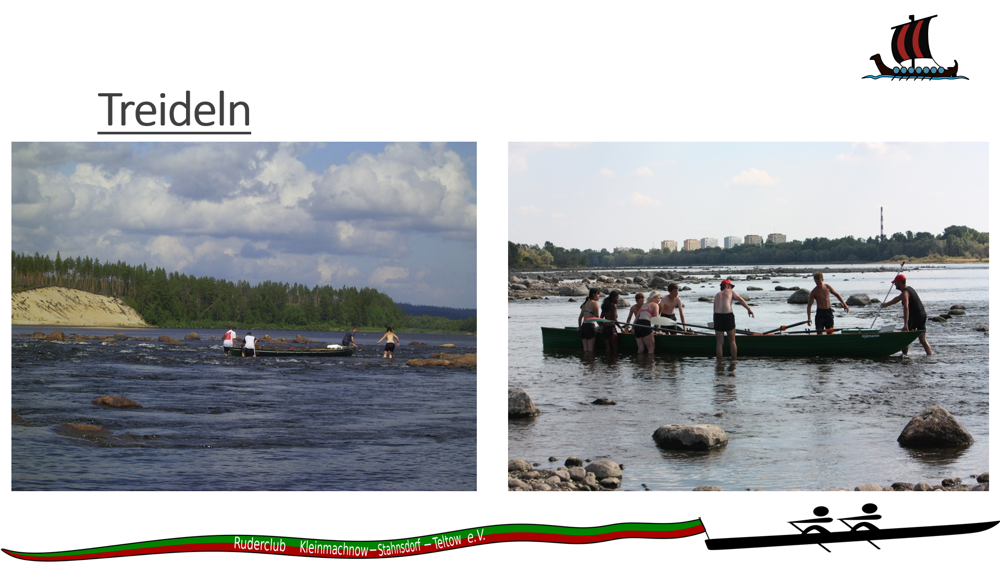

- Boote mittig legen
- Skulls aus den Dollen nehmen
- Steuer raus nehmen
- Gepäck aus Heck und Bug nehmen

- kontrollieren, ob die Gasse frei und unbeschädigt ist
- erst einfahren, wenn die Gasse komplett durchströmt ist
- gerade einfahren
- Skulls lang, gerade sitzen
- in der Gasse nicht steuern

- wenn die Gasse zu eng ist treideln

