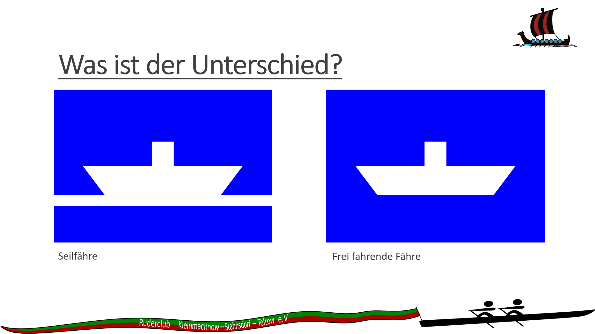
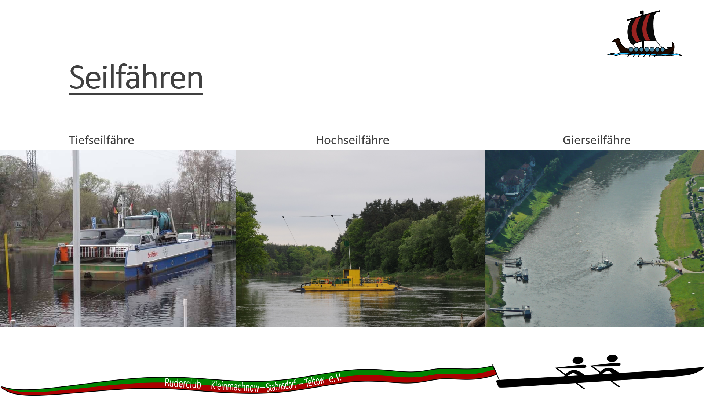
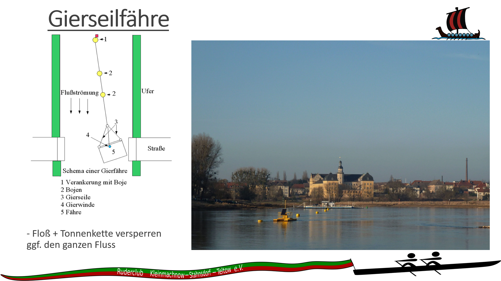

- Fähren haben grundsätzlich Vorfahrt

- Niemals vor einer Seilfähre vorbei rudern
- Bei Tiefseilfähren achten wie hoch das Seil läuft
- Niemals über ein gespanntes Seil fahren

- Rechtzeitig beobachten ob die Fähre fährt, oder demnächst losfahren wird
- Niemals über das gespannte Seil rudern
- Wenn das Seil den Fluss sperrt, wenden und aufwärts rudernd auf der Stelle warten
  
