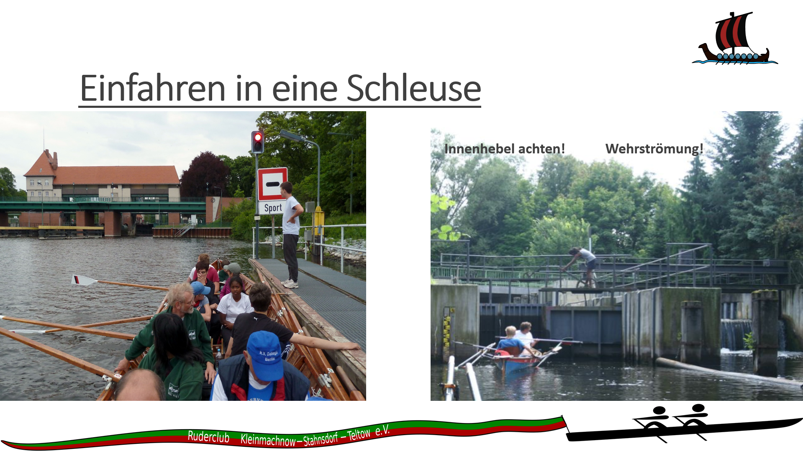
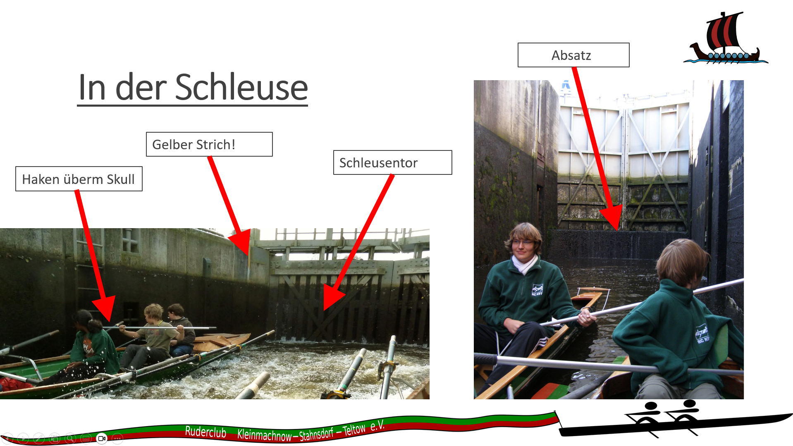
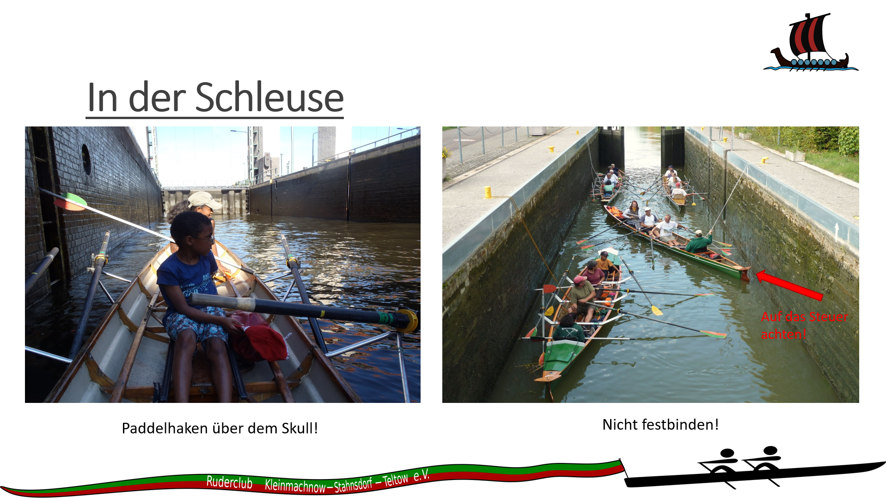
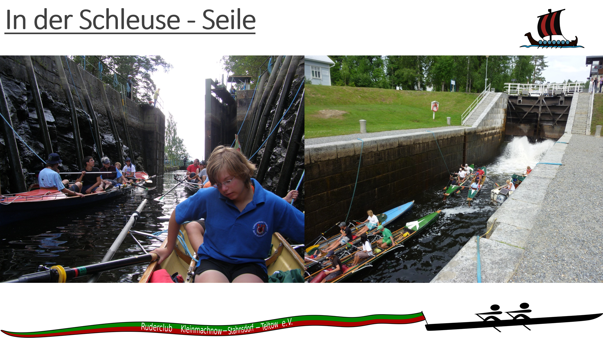
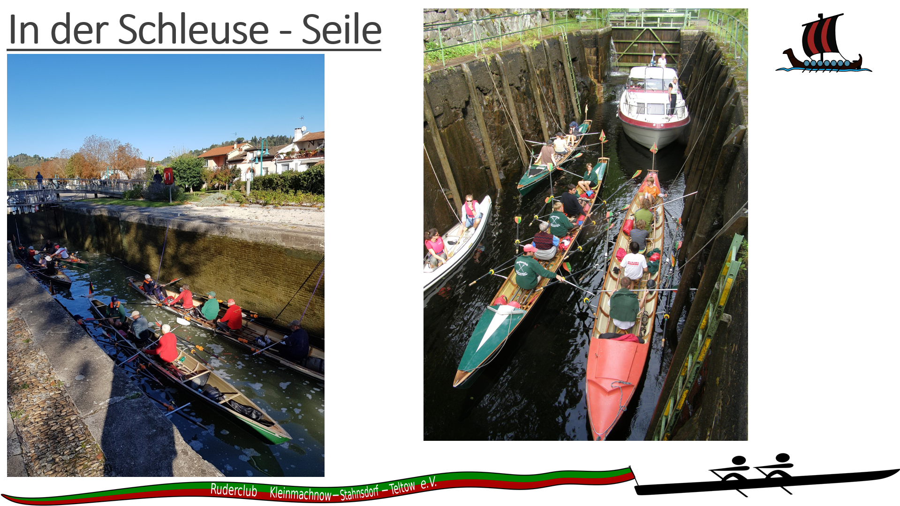
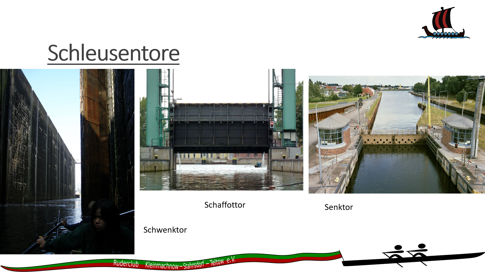
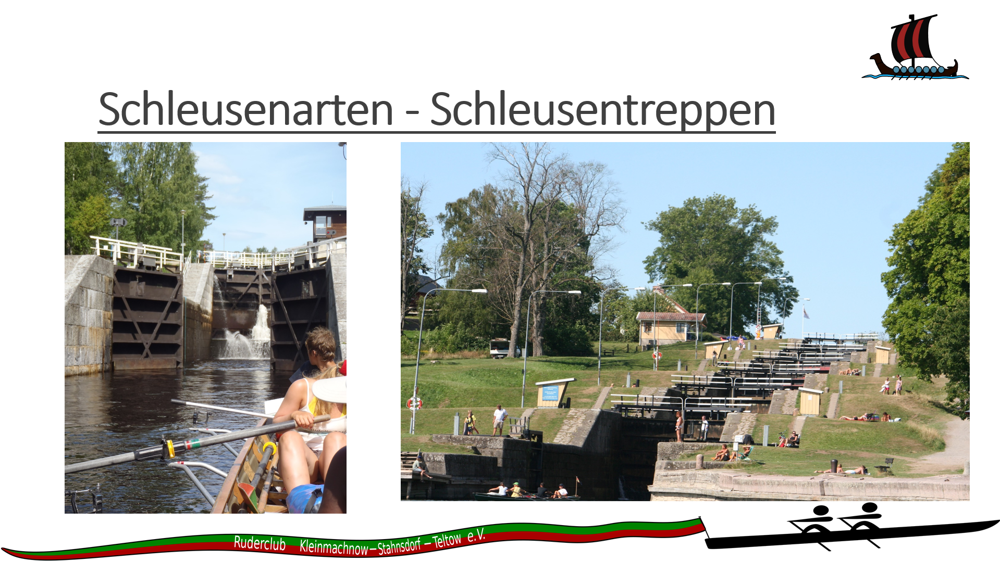
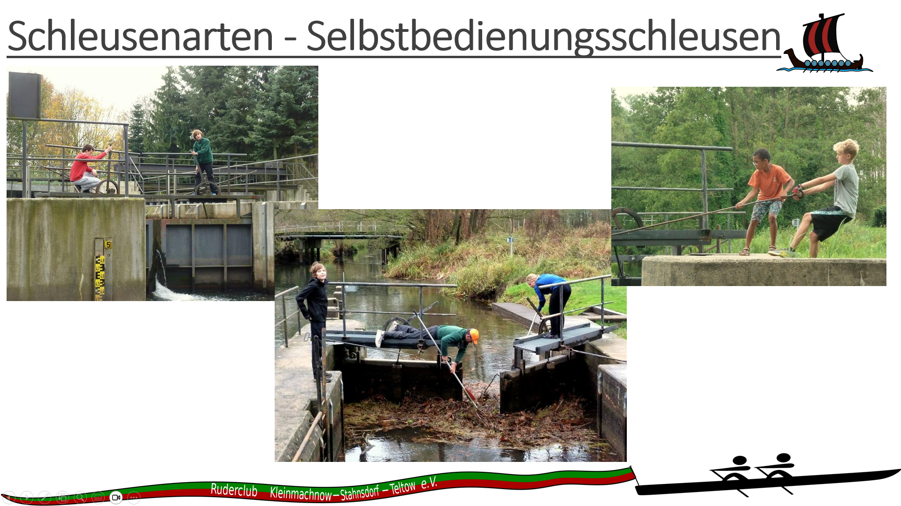

- Einfahren, wenn Ampel grün zeigt oder der Schleusenwart auffordert
- grundsätzlich nach der Berufsschifffahrt, es sei den der Schleusenwart verlangt etwas anderes

- Seile in Gegenrichtung spannen, trapezförmig, sonst ist das Boot nur in eine Richtung gesichert

- Ausfahren erst wenn Ampel auf grün oder der Schleusenwart auffordert
- Abstand zur Berufsschifffahrt halten (Verwirbelung!)
- Zügig ausfahren, Achtung bei Automatikschleusen

