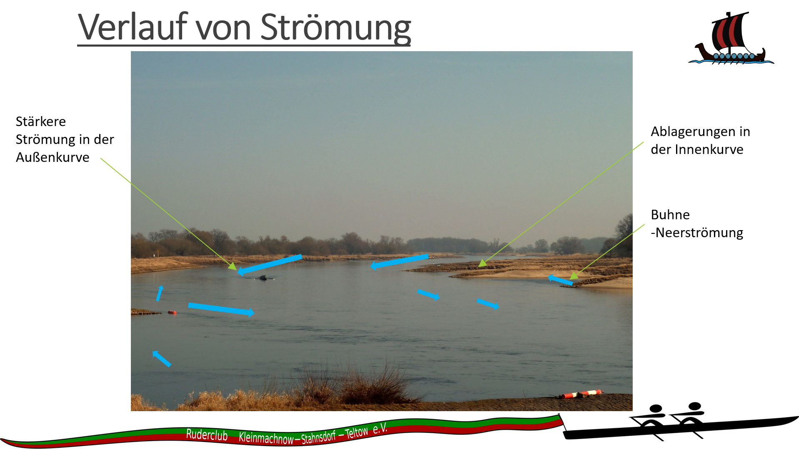
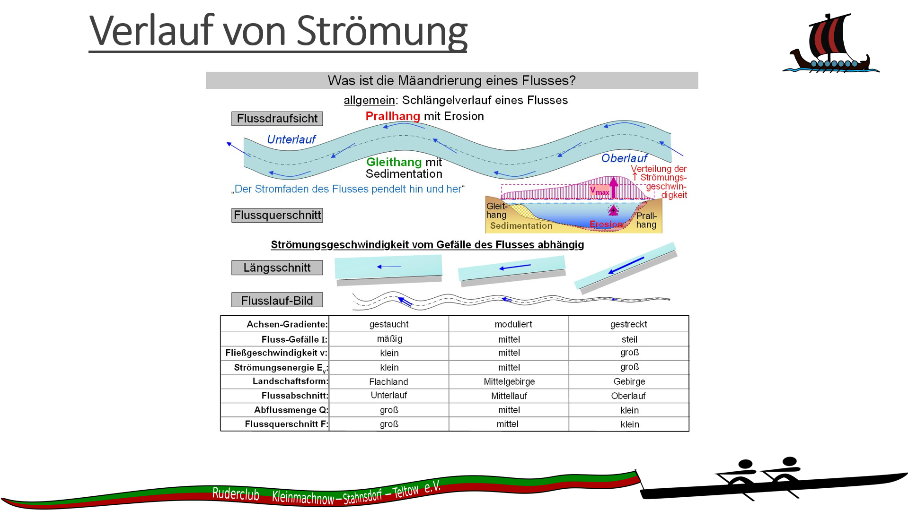
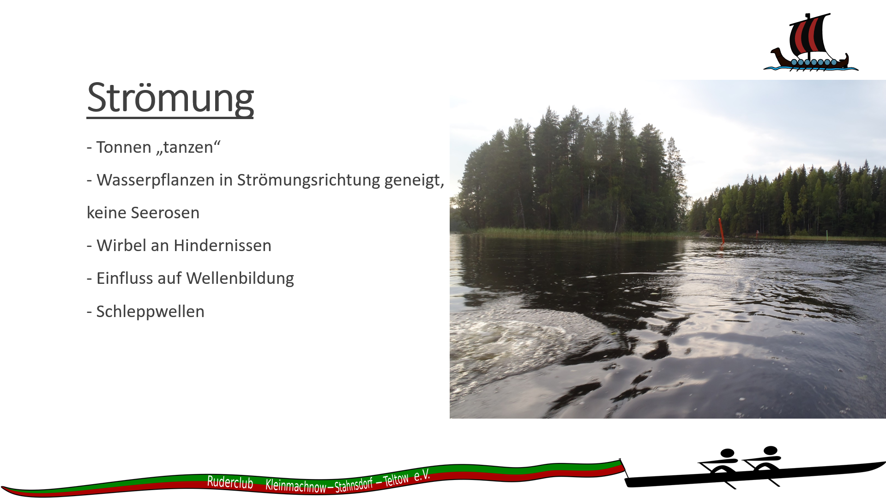
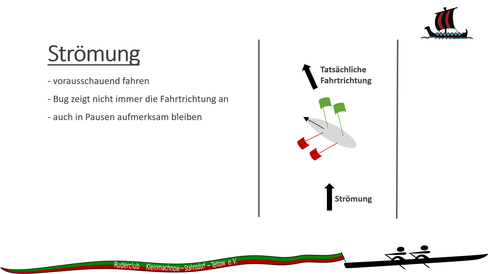
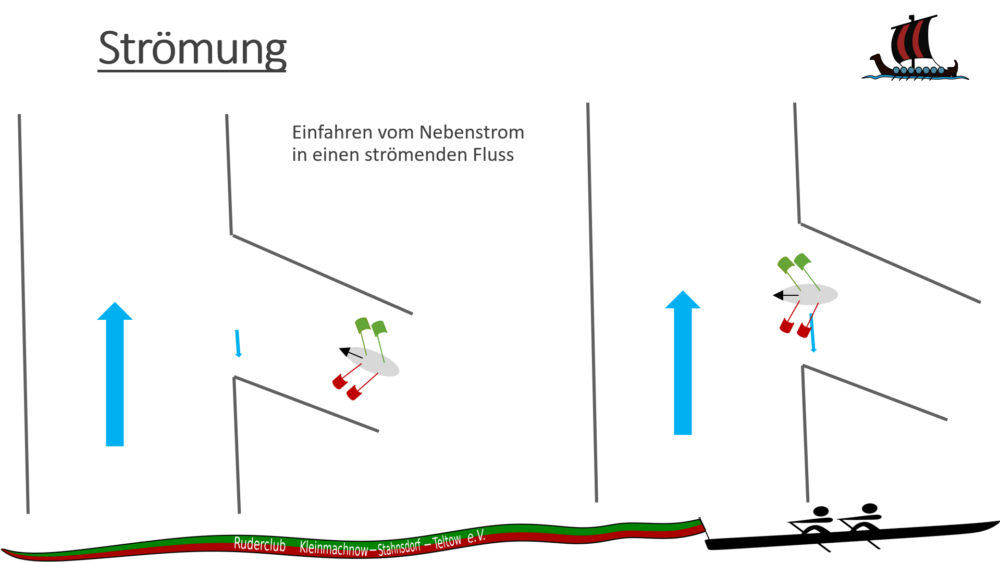
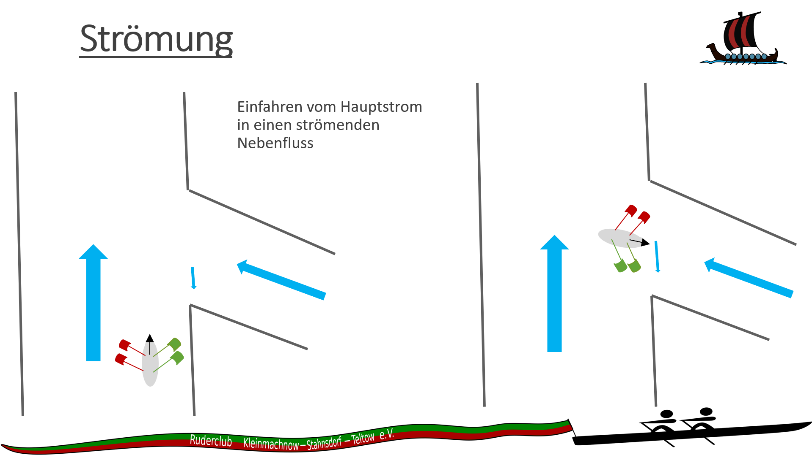
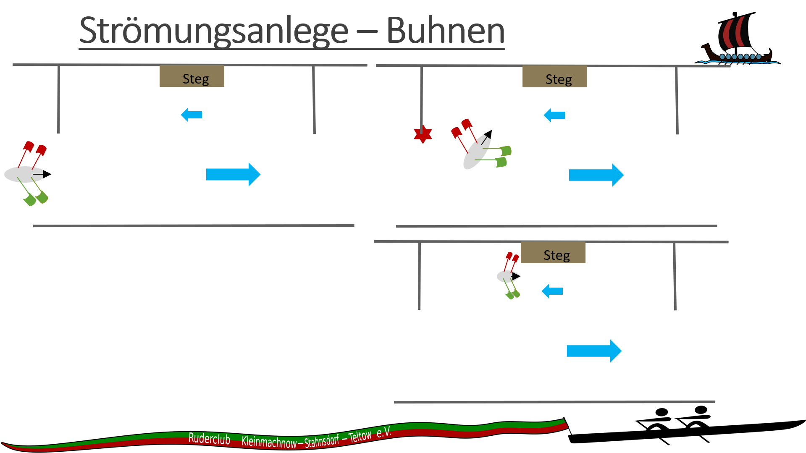
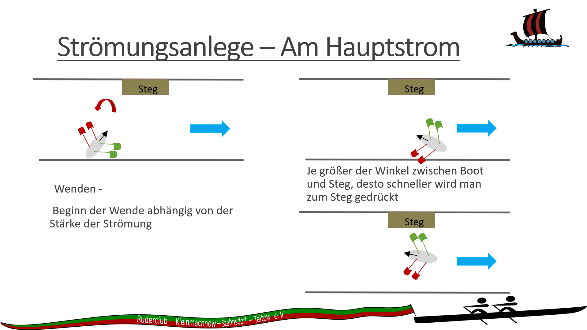
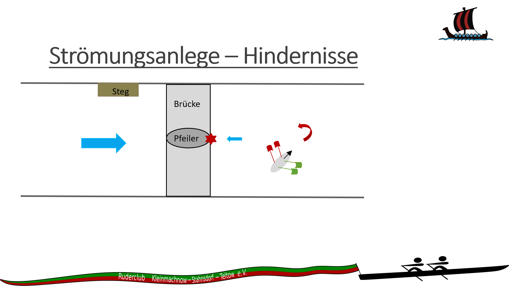

- senkrecht und mit Druck einfahren
- sobald der Bug in der Strömung ist, wird das Boot abwärts gedreht

- der Bug in der Nehrströmung sorgt für eine Drehbewegung flussaufwärts
- das Heck schräg in der Flussströmung sorgt für eine Drehbewegung flussaufwärts
- in Summe sehr schnelle Drehung
- bei engen Einfahrten möglicherweise von flussabwärts einfahren, anstrengender, aber sicherer

- niemals oberhalb von Brückenpfeilern wenden
- die Nehrströmung unterhalb des Brückenpfeilers zieht das Boot aufwärts, Abstand halten
